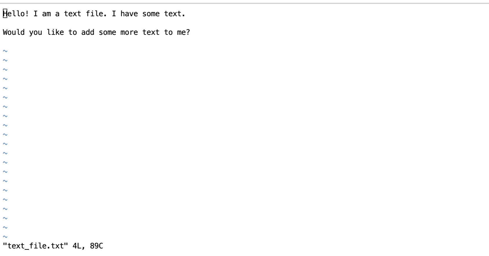
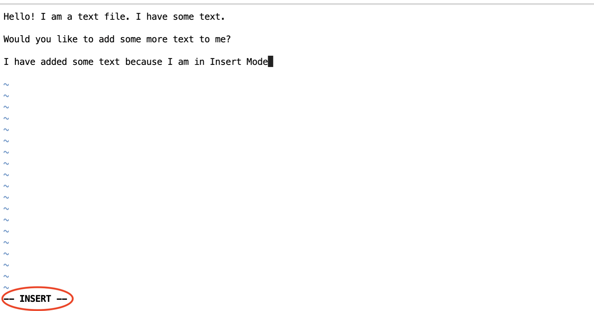
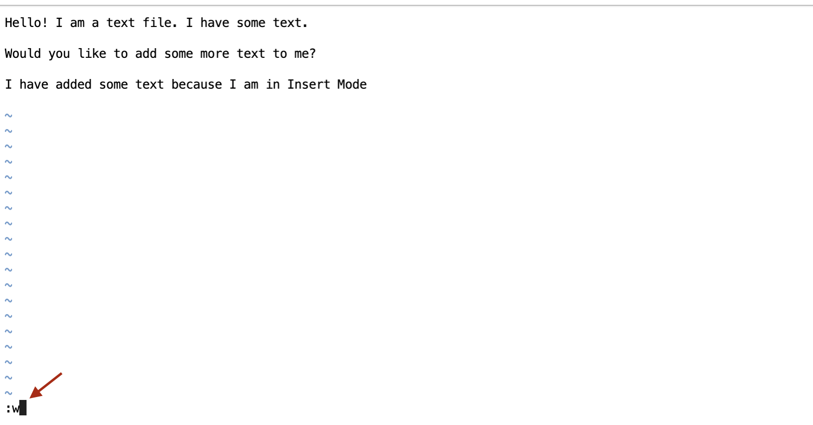
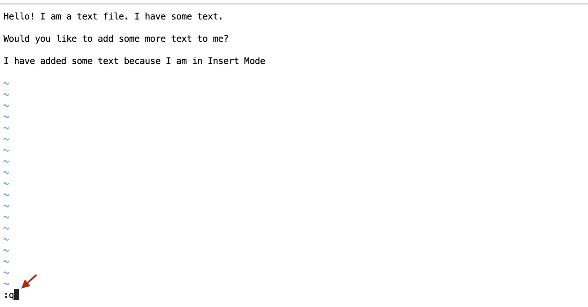

# Purpose

This challenge is going to show you the very basic Unix and Vim skills you need to work on
the Hands-On HPC Challenges. If you have some experience with Vim or Unix, you can skip
this challenge.

# Working in a Unix System

In order to accomplish tasks in any high-performance computing system, you need to know
how to navigate through and issue commands in a UNIX or Linux operating system. In these
operating systems, all interactions you have with the computer will be done via the
issuing of text based commands, as opposed to clicking around on a graphical interface, in
order to open and modify files or run programs.

In this section you will learn about the command line and how to list files in your
current directory, make directories, change from one directory to another, and copy and
remove files.


## The command line

The command line (also called a command prompt) is a text interface for a computer. It is
the place in which you type the commands that will be interpreted and executed by the
computer when you enter them. From the command line, you can run programs and navigate
through files and folders just like you would with Windows Explorer on Windows or Finder
on MacOS.

Here is an example of a command line prompt:

```
[subil@login1.summit ~]$
```

The prompt here is the "$". Your commands will be typed after it. 

The system in this example has been set up so the user's user ID and the name of the login
node and system are displayed in brackets before the prompt.  Not all systems will have
this feature. Some will just start with the "$".

As an example, type in the command `whoami` into the command line and press Enter. This
will print out your username like so:

```
[subil@login1.summit ~]$ whoami
subil
```


## Work with Directories

You will need to learn to navigate the filesystem in order to find and access your
files. The filesystem is a collection of files and directories. 'Directory' is just the
UNIX term for 'folders' on Windows. The commands in a command line are always executed
from the directory you are currently in. You can find out what directory you are currently
in with the `pwd` command. `pwd` will give you your 'present working directory'. 

```
[subil@login1.summit ~]$ pwd
/ccs/home/subil
```

This tells you that you are in the `/ccs/home/<user>` directory where you should
replace `<user>` with your username. This directory is where you will land by default when
you first log in on the terminal. The string with forward slashes like e.g. `/ccs/home/subil`
is a called a _path_. If you are not already in this directory, you can use the `cd`
command to navigate here as we will see next.


Let's now try to move around in the filesystem. To move to a different directory we will
need to use the `cd` command to 'change directory'. On the command line, you have to type
in `cd` followed by the _path_ of the directory you want to go to. If earlier, `pwd` didn't show that
you were in your `/ccs/home/<user>` directory, we can use `cd` followed by the path to get there.

```
[subil@login1.summit ~]$ cd /ccs/home/subil
[subil@login1.summit ~]$ pwd
/ccs/home/subil
```

Make sure you replace `subil` with your actual username. We are just using `subil` as an example.


> By this point, if you haven't already done it, execute `git clone
> https://github.com/olcf/hands-on-with-summit/` on the command line (type it into the
> command line and press Enter) to download the Hands
> On With Summit repository. The output should look something like:
> 
> ```
> [subil@login1.summit ~]$ git clone https://github.com/olcf/hands-on-with-summit/
> Cloning into 'hands-on-with-summit'...
> remote: Enumerating objects: 1486, done.
> remote: Counting objects: 100% (445/445), done.
> remote: Compressing objects: 100% (248/248), done.
> remote: Total 1486 (delta 222), reused 401 (delta 185), pack-reused 1041
> Receiving objects: 100% (1486/1486), 95.52 MiB | 3.26 MiB/s, done.
> Resolving deltas: 100% (829/829), done.
> ```


In order to see what files and directories are present in your current directory, you use
the `ls` command which will 'list' your current directory's contents. Your output if this
is your time on these systems will look something like this

```
[subil@login1.summit ~]$ ls
hands-on-with-summit
```

From here, let us try using `cd` to get to the `Basic_Unix_Vim` challenge directory in the
`hands-on-with-summit` repository we downloaded.

```
[subil@login1.summit ~]$ cd hands-on-with-summit/challenges/Basic_Unix_Vim
```

This is the path _relative to your current directory_ (which would be
`/ccs/home/<user>`). You can also use the _absolute path_ with `cd` i.e. the path string
starting with `/` is called a absolute path. This will take you to the same directory.

```
[subil@login1.summit ~]$ cd /ccs/home/<user>/hands-on-with-summit/challenges/Basic_Unix_Vim
```


Execute `pwd` to check if you're in the right place, and execute `ls` to see what files are
available in this directory. 

```
[subil@login1.summit Basic_Unix_Vim]$ pwd 
/ccs/home/<user>/hands-on-with-summit/challenges/Basic_Unix_Vim
[subil@login1.summit Basic_Unix_Vim]$ ls
images README.md text_file.txt
```

If you want to go back to where you were,
remember the previous path you had and use `cd` to navigate there e.g. `cd
/ccs/home/<user>` . 

```
[subil@login1.summit Basic_Unix_Vim]$ cd /ccs/home/subil
[subil@login1.summit ~]$ pwd
/ccs/home/subil
```

Let us now learn how to create a new directory. Now that you are in the `Basic_Unix_Vim`
directory, create a new directory by executing the `mkdir` command followed by the name of
the directory. For example, to create a directory named 'mydirectory', do the following:

```
[subil@login1.summit Basic_Unix_Vim]$ mkdir mydirectory 
[subil@login1.summit Basic_Unix_Vim]$ ls
images mydirectory README.md text_file.txt
```

Now that we have a new directory, let us try copying a file to that new directory. For
copying, we use the `cp` command to "copy" a file to another location. The format is `cp`
followed by the name of the file to copy as well as the path of the new location where the
file needs to be copied to. Let us try to copy the file `text_file.txt` to the newly
created `mydirectory` directory. To do that, we can do the following on the command line

```
[subil@login1.summit Basic_Unix_Vim]$ cp test_file.txt mydirectory
```

Remember that specifying the full path for the file or directory will also work. In this
case, we could write the below

```
[subil@login1.summit Basic_Unix_Vim]$ cp /ccs/home/<user>/hands-on-with-summit/challenges/Basic_Unix_Vim/text_file.txt /ccs/home/<user>/hands-on-with-summit/challenges/Basic_Unix_Vim/mydirectory
```

You can check the contents of a directory with `ls` without first using `cd` to go to that
directory, by using `ls` followed by the path or directory name.

```
[subil@login1.summit Basic_Unix_Vim]$ ls mydirectory
text_file.txt
```

You can see that `text_file.txt` has been successfully copied to the directory `mydirectory`.

# Editing Files

We will now learn to edit files using a command line text editor called Vim. Vim is a
standard text editor available on almost all systems where you have to use a command
line. It provides the quickest way to view and modify files when you don't have access to
graphical text editors that you might be used to.

You should be familiar with the command format by now. To open a file in Vim, execute the `vim`
command with the name of the file. Try to open the file `text_file.txt` with Vim.

```
[subil@login1.summit Basic_Unix_Vim]$ vim text_file.txt
```

This will open a window that looks like this:



Vim has two main modes, __Insert Mode__ and __Normal Mode__. When Vim opens a file, it
will always open in Normal Mode. To start actually editing the text, you need to enter
Insert Mode. To do this, press the letter 'i' on your keyboard. You will see the little
indicator on the bottom left appear saying `-- INSERT MODE --` as you can see in the image below.



Try typing in some sentences. Once you are done, you need to be able to save and/or exit
Vim. To do that, you must first go back to Normal Mode. To go to Normal Mode, press the
`Escape` key or press `Control key + [` on your keyboard. You will see the little `--
INSERT MODE --` indicator disappear as you can see in the image below.


Once in Normal Mode, you can save by typing on your keyboard `:w`. These characters won't
appear in the main text but will appear in the bottom left. `:w` is the command for Vim to
'write' the file to disk, thus saving the file. 



You can exit out of Vim and go back to the command line by typing in `:q`. If you haven't
saved, you will get a warning and Vim won't exit, so make sure you save the file with `:w`
first. 




And that should give you the basics you need for UNIX and Vim! Try working through the
other challenges in this repository now. If you want more in depth details about using
UNIX and Vim, you can find it in the `intro_to_unix` and `intro_to_vim` directories in the
[Foundational HPC Skills repository](https://github.com/olcf/foundational_hpc_skills)

# Cheatsheet

__UNIX__

Anything in [square brackets] is optional for that command.

Command                       | Description                                                                            |
------------------------------|----------------------------------------------------------------------------------------|
pwd                           | Print the current directory you are in (your 'present working directory')              | 
cd /path/to/file              | Navigate to the directory location given by the path                                   |
ls [path or directory]        | List the files and directories in your current directory or in the directory specified |
mkdir directoryname           | Create a new directory in your current directory with the name you give                |
cp filename /path/to/location | Copy the file to the directory given by the path                                       |
vim filename                  | Open a file in Vim                                                                     |


__Vim__

Command              | Description                                                               |
---------------------|---------------------------------------------------------------------------|
i                    | Enter __Insert Mode__ in order to edit text                               |
Escape or CTRL+[ key | Enter __Normal Mode__ to save the file and quit Vim                       |
:w                   | (In Normal Mode) Save the file                                            |
:q                   | (In Normal Mode) Quit Vim and go back to the command line                 |
