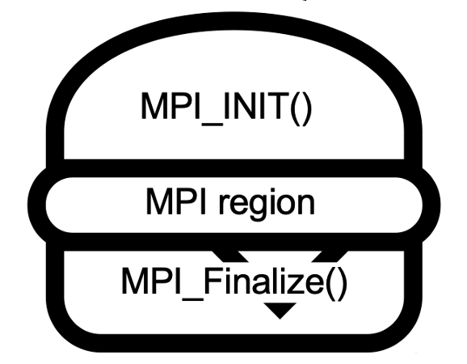
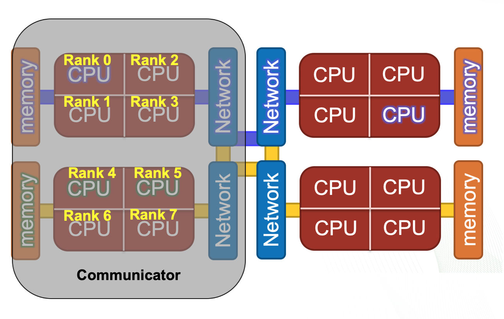
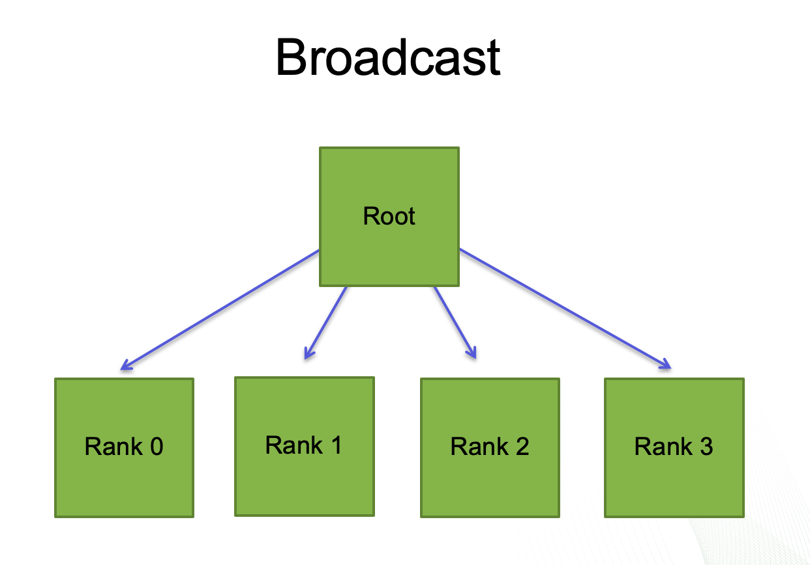
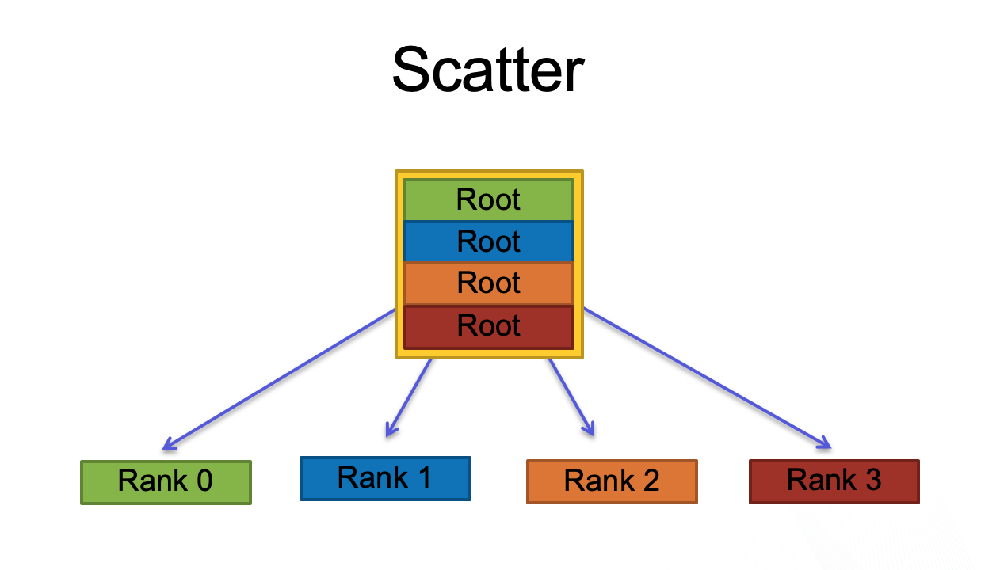
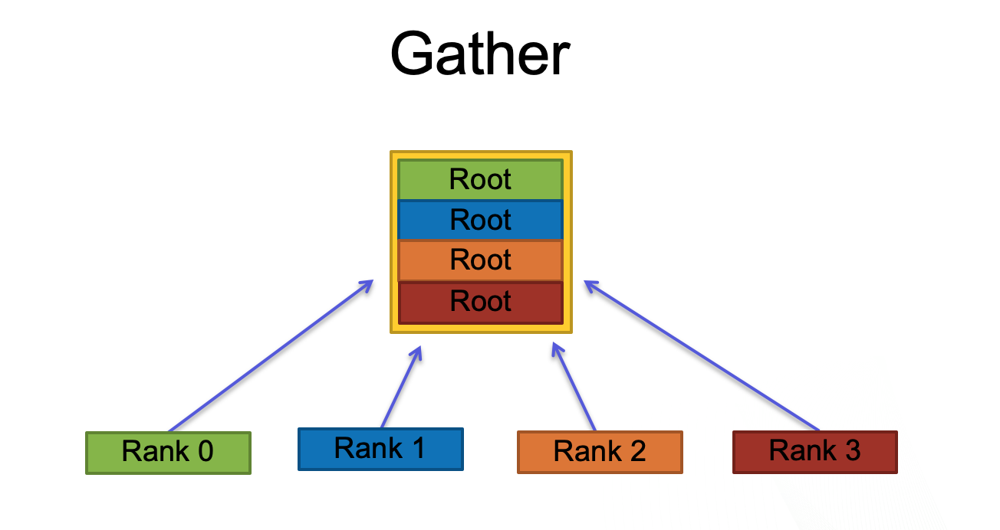

# What is MPI? 

The **M**essage **P**assing **I**nterface (MPI) is a set of library functions, methods, and specifications that can be called to distribute a code's processing work between nodes or processors on the same node.  It does this by passing messages between the processors. It is governed by a set of community driven standards. The MPI standard can be found here: [MPI: A Message-Passing Interface Standard Version 3.1]( https://www.mpi-forum.org/docs/mpi-3.1/mpi31-report.pdf). 

The basic flow of MPI within in a program is:
1. Initialize communication 
2. Communicate between processes to share data
3. Exit the communication


This neat encapsulation of data and instructions in portable messages allows different processes to run on nodes that have different pools of memory. Each process has its own unique copy of the data, variables, and instructions for its task. 

MPI also works well on nodes where processing elements share memory, but other parallel methods designed for shared memory may be more efficient in that situation. MPI is often used in conjunction with OpenMP and other shared-memory threading methods.  For example, you might use MPI to pass work between compute nodes and then use OpenMP threads to divide work among the different processing elements on the node. 

This challenge will explore an MPI helloworld and two kinds of MPI communication patterns. We will use C code and pass its work with MPI between CPU cores on the same node so that we have enough nodes available for everyone to do this at once.


# MPI Terminology  
 
**Communicator**   An object that represents a group of processes than can communicate with each other. 

**Rank** Within a communicator each process is given a unique integer ID. Ranks start at 0 and are incremented contiguously. Ranks can be mapped to hardware processing elements like CPU cores. 

**Size** The total number of ranks in a communicator.

**MPI Region** The part of the code that will be executed in parallel using one MPI communicator. It will always be sandwiched between  MPI_Init and 
MPI_Finalize function calls.


<br>
<center>

</center>
<br>

**The Communication Sandwich**                                  


For a typical MPI program, the number of ranks is set by the programmer in the command used to run the program. This allows the programmer to try differnt numbers of processes per task without needing to change the code. 

The first thing MPI does when it is initialized, is set up the communicator. You can think of a communicator as a package that holds all the needed organizational information for its MPI region in the code. Inside the communicator each process is given a rank. The size of the communicator is equal to its total number of ranks. 

All MPI function calls within the same MPI region will get each process’s rank from the communicator. The programmer must use logic, based on the MPI rank's ID to differentiate the code paths. 

<br>
<center>

</center>
<br>


**A communicator of size 8, with 8 ranks that map to 8 processes running on 8 CPU cores.** 

# MPI Functions and Helloworld

MPI consists of hundreds of functions, but most users will only use a handful of them. 
We'll start by looking at the functions needed for an MPI Helloworld program. 

Below is an outline for the program and its MPI functions. For this challenge, review the outline and then try to use it to find the missing MPI function in your copy of mpi_hello.c 


**Helloworld Outline**

We have setup this example to use 4 ranks, each mapped to a separate core on the node. This was done in the submission script, which you may look at if you wish, with `cat /hello/submit_hello.lsf`.

The line in the submssion script that sets this example to use 4 ranks with one per core is: 
```
. . .

jsrun -n 4 -c 1 ./run

```
You won't need to change or edit this script. It is only shown so you know where we set up the number of ranks. Now we will look at an outline of the program.


* First initialize  MPI. 
  
  This is done with a function:

  ```
  MPI_Init(&argc, &argv);
  ```
When the MPI_Init function is called, all of MPI's global and internal variables are constructed.  A communicator is setup to contain all of the processes that were spawned, and unique ranks are assigned to each process. The arguments argc and argv are empty in this case. Do not focus on them for now. 

* Next get the number (size) of processes from the communicator. 
  
  This is done with another MPI function: 
  
  ```
  MPI_Comm_size(MPI_COMM_WORLD, &size); 
  ```
  In this case, the communicator is named MPI_COMM_WORLD. This function returns the size of the communicator which is equal to the number of ranks. 
 
* Next get the rank ID of each process from the communicator. 
  
  This is also done with an MPI function: 
  ```
  MPI_Comm_rank(MPI_COMM_WORLD, &rank);
  ```
  Ranks are IDs used for sending and receiving messages for each process. 

* Print "Hello" from each rank distributed on each processor. This is just C code. 


* Finalize MPI. 
  Yet another MPI function. 
  ```
  MPI_Finalize();
  ```
  This function cleans up MPI and releases the communicator. No MPI functions will be recognized below this function. 

Now it is your turn. Use the outline to help find and enter the missing MPI function in mpi_hello.c. To do this: 

1. Go to hands-on-with-summit/challenges/MPI_Basics/hello/ .
```
$ cd hands-on-with-summit/challenges/MPI_Basics/hello/

```
2. Use your favorite editor or Vim to find and enter the missing MPI function in mpi_hello.c. For example

```
$ vi mpi_hello.c
```


The mpi_hello.c will look like this: 

```bash
#include "stdio.h"
#include "mpi.h"

int main(int argc, char **argv)
{
    int rank, size;

    /*----------------*/
    /* Initialize MPI */
    /*----------------*/

     MPI_Init(&argc, &argv);

    /*------------------------------------------------------*/
    /* Get the number of ranks (size) from the Communicator */
    /*------------------------------------------------------*/

     MPI_Comm_size(MPI_COMM_WORLD, &size);

    /*------------------------------------------------------*/
    /* Get the Rank ID for each process                     */
    /* Fix the code here.                                   */
    /*------------------------------------------------------*/


    /*------------------------------------------------------*/
    /* Print hello from each rank                           */
    /*------------------------------------------------------*/

     printf("Hello from rank %d of %d total \n", rank, size);

    /*------------------------------------------------------*/
    /* Clean up and finalize the MPI environment            */
    /*------------------------------------------------------*/

     MPI_Finalize();

    return 0;
}

```

Once you think you have updated the file to include the missing function, compile the code. 

To compile mpi_hello.c 

```
$ make
````

To run the code 

```
$ bsub submit_hello.lsf 
```

This submission script will ask for 1 node with 4 MPI ranks and one rank on each core. Thus, the size (number of ranks) that gets passed to MPI is 4. 
If it succeeded, you should see the following output in the hello.<job_id> output file: 

```
Hello from rank 3 of 4 total
Hello from rank 2 of 4 total
Hello from rank 1 of 4 total
Hello from rank 0 of 4 total
```
Note: Note: The ranks run independently so the order they return in may not be the 3,2,1,0 as see in my output. That's OK for this example. However, synchronizing tasks is one of the things that MPI programmers do have to think about when the order does matter. That is beyond the scope of this introduction though. 

If you had an error go back and check your code , then recompile it, and try again. You may also look at mpi_hello_solution.c to check your answer.  

If you wanted to run with 10 ranks, you would change the jsrun line in the submission script:

from

```
jsrun -n 4 -c 1 ./run
```
to

```
jsrun -n 10 -c 1 ./run
```

We mention this because a nice feature of MPI programs that are structured like this, is that the user can change the size of the problem from the submit file without making changes in the code that would require it to be recompiled.


# Point to Point MPI Communication 

We'll dive a little deeper into understanding MPI functions as we explore Point to Point communication. 

Point to Point communication is one way you can finely control how you divide work between processors. Point to Point routines involve two and only two processes. One process explicitly initiates a send operation and one process explicitly initiates a receive operation.


In the code that you will work with for this part of the challenge, Process 0 will send a message "hello!" to process 1. The two new MPI functions we will use to accomplish this will be MPI_Send and MPI_Recv. We will also need the MPI_Comm_rank function that you just learned about to get the ranks of the processes from the communicator. 

Below is the MPI_Send function. It is used to send a message from one process to another process. 

```
int MPI_Send(void *buf, int count,
             MPI_Datatype datatype, int dest,
             int tag, MPI_Comm comm)

```
In this function: 
* buf - Initial address of send buffer. The message you want to send will be packed-up into this buffer. 

* count - Number of elements to send. For example, if you are going to send a message that has 6 data elements of type datatype, the value for count would be 6. 

* datatype - This is the MPI datatype of each element in the send buffer. There are built-in data types for all intrinsic C types: MPI_INT, MPI_FLOAT, MPI_DOUBLE, MPI_CHAR, etc. If you wanted to send "hello!" from process 0 to process 1, you would use a datatype of MPI_CHAR. 

* Dest - Rank of destination. This is the ID of where the message will go. 

* Tag - Integer tag used by receiver to identify message. 

* Comm - Communicator 

This functions retruns after send buffer is ready to reuse. 

Here is the MPI Receive function. 

```
int MPI_Recv(void *buf, int count,
             MPI_Datatype datatype, int source,
             int tag, MPI_Comm comm, MPI_Status status)
```

In this case the function's arguments mean: 

* buf - Initial address of receive buffer
* count - Maximum number of elements that can be received
* datatype - MPI_Datatype of each element in receive buffer
* source - Rank of source
* tag - Integer tag used to identify message
* comm - Communicator
* status - Struct containing information on received message 

This functions returns after receive buffer is ready to reuse. 

Here is the code ptp.c, where process 0 will send the message "hello!" to process 1. The receive function has three missing arguments labeled A, B. and C. 
Your challenge is to use the arguments in the send function and the function definitions above to fill in the missing arguments. 

Some of the questions to help you:
Why does the MPI_Send function say that the message has 6 elements?
What datatype is "hello!" ? 
Where is the message coming from? 

```bash
#include <stdio.h>
#include <string.h>
#include "mpi.h"

int main(int argc, char ** argv)
{
  int rank, ntag = 100;
  char message[14];
  MPI_Status status;

  /*----------------*/
  /* Initialize MPI */
  /*----------------*/

  MPI_Init(&argc, &argv);

  /*------------------------------------------------------*/
  /* Get my rank in the MPI_COMM_WORLD communicator group */
  /*------------------------------------------------------*/

  MPI_Comm_rank(MPI_COMM_WORLD, &rank);

  /*---------------------------------------*/
  /* Process 0 sends a message to process 1*/
  /*---------------------------------------*/

  if (rank == 0) {
    strcpy(message, "hello!");
    MPI_Send(&message, 6, MPI_CHAR, 1, ntag, MPI_COMM_WORLD);
  }

  /*----------------------------------------------*/
  /* Process 1 receives a message from process 0  */
  /* and outputs the result                       */
  /* Use the send function and the definition     */
  /* of MPI_Recv to fill in A,B and C below       */
  /*----------------------------------------------*/
  
  if (rank == 1 ) {
    MPI_Recv(&message, A?, B?, C?, ntag, MPI_COMM_WORLD, &status);
    printf("Process %d : %s\n", rank, message);
  }

  /*--------------*/
  /* Finalize MPI */
  /*--------------*/

  MPI_Finalize();

}
```

To do this challenge: 
1. Determine the missing arguments. 

2. Go to hands-on-with-summit/challenges/MPI_Basics/ptp/. 
```
$ cd hands-on-with-summit/challenges/MPI_Basics/ptp/

```
3. Edit the Receive function in ptp.c with your A, B and C arguments. 

4. Complle ptp.c 


```
$ make

```

5. Submit the job. 

```
$ bsub submit_ptp.lsf
```

If your code ran correctly, you will see:

```
Process 1 : hello!
```

 If you want to know more about point to point communication, see: [https://computing.llnl.gov/tutorials/mpi/](https://computing.llnl.gov/tutorials/mpi/). We also want to credit the [National Institute for Computational Sciences](https://www.nics.tennessee.edu/mpi-tutorial) for the idea for this example and you can find more send and receive challenges on their page.


# MPI Collectives 

The last type of MPI communication we will introduce is Collective Communication, in which all the processes in a communicator must participate. 
Collective Communication serves several purposes:
* Synchronization
* Data movement
* Reductions

Routines often originate or terminate at a single process known as the "root".

We will start with the broadcast function, where the root process sends data to all the other processes. Thinking back to our hello_world example, we were able to have the rank ID and number of ranks setup for all processes by MPI_Init and MPI_Comm_rank. In the following example we build on that by sending the same data, in the form of an integer, to each rank. The data that you broadcast is initialized just for the root process.

Here is the broadcast function:

<br>
<center>

</center>
<br>

```
int MPI_Bcast(void *data, int count, MPI_Datatype datatype, int root, MPI_Comm comm)
```

The function arguments are: 
* data - Initial address of send buffer
* count - Number of elements to send
* datatype - Datatype of each element in send buffer
* root - Rank of node that will broadcast buf 
* comm - Communicator

Here is its use.

```bash
#include “stdio.h”
#include “mpi.h”

int main(int argc, char **argv)
{
    int rank, root, bcast_data;
    root = 0;
/*-------------------------------------------------*/
/* Initialize root process with integer 10         */
/*-------------------------------------------------*/
    if(rank == root)
           bcast_data = 10; 
/*-------------------------------------------------*/
/* Initialize MPI                                  */
/*-------------------------------------------------*/
   
    MPI_Init(&argc, &argv);
    MPI_Comm_rank(MPI_COMM_WORLD, &rank);

/*-----------------------------------------------*/
/* Broadcast integer from root to all processes  */
/*-----------------------------------------------*/

    MPI_Bcast(&bcast_data, 1, MPI_INT, root, MPI_COMM_WORLD);
    
    printf("Rank %d has bcast_data = %d\n", rank, bcast_data);
  
/*-----------------------------------------------*/
/* Finalize MPI                                  */
/*-----------------------------------------------*/

   MPI_Finalize();
    return 0;
}
```


To find this code: 

```
$ cd hands-on-with-summit/challenges/MPI_basics/bcast/mpi_bcast.c
```

To compile it:

```
$ make
```

To run it: 

```
$ bsub submit_bcast.lsf
```

The output file will be called bcast.<job__number>. When you open this file, you should see that every rank has been sent the integer 10.

Two other collectives you should be familiar with, are the MPI_scatter and MPI_gather functions. MPI_scatter sends a specified part of an initial array from the root process to each other process. MPI_Gather collects local data from each process and sends it to the root process. 

<br>
<center>

</center>
<br>

<br>
<center>

</center>
<br>

If you want to challenge yourself with implementing either of these functions, see the exercises in this [MPI Tutorial](https://mpitutorial.com/tutorials/mpi-scatter-gather-and-allgather/). 

