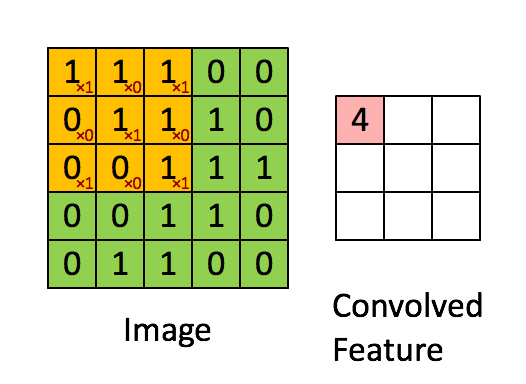
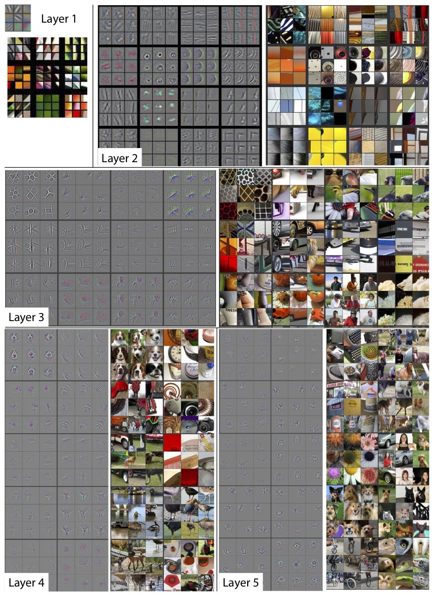

# Python: PyTorch CNN Basics

Machine learning (ML) uses statistical learning algorithms to build applications that have the ability to automatically learn and improve from its experiences.
Most of us use ML in our day to day life when we use services like search engines, voice assistants, and recommendations on Netflix.
In ML, an algorithm is trained by providing it with a significant amount of data and allowing it to learn more about the processed information.

Deep learning (DL) is a subset of ML that is inspired by the way a human brain filters information (like recognizing patterns and identifying objects).
Since DL processes information in a similar manner as a human brain does, it is mostly used in applications that people generally perform (e.g., driverless cars being able to recognize a stop sign or distinguish a pedestrian from another object).
Using DL in this manner is typically done via a Convolutional Neural Network (CNN), which is useful for analyzing image data.

As ML/DL models evolve to keep up with the complexity of the real world, a supercomputer's resources get more and more valuable.
In high-performance computing (HPC), ML/DL is getting more and more popular because of the sheer amount of data that needs to be processed and the computational power it requires.
To process and train an accurate ML/DL model in a reasonable amount of time, more and more compute nodes are required as the amount of big data increases.

[PyTorch](https://pytorch.org/) is a library for Python programs that pairs well with HPC resources and facilitates building DL projects.
PyTorch emphasizes the flexibility and human-readableness of Python and allows deep learning models to be expressed in a similar manner.
Think about the simplicity, structure, and usefulness of NumPy and its arrays, but more geared toward ML/DL algorithms and its tensors -- that's what PyTorch is.
Compared to other frameworks and libraries, it is one of the more "beginner friendly" ML/DL packages due to its dynamic and familiar "Pythonic" nature.
PyTorch is also useful when GPUs are involved because of its strong GPU acceleration ability.
On Frontier, PyTorch is able to take advantage of the many AMD GPUs available on the system.

In this challenge, you will:

* Learn how to access PyTorch on Frontier
* Learn the basics of PyTorch
* Learn about Convolutional Neural Networks (CNNs)
* Tune your own CNN on Frontier


Table of Contents:

* [Setting Up Our Environment](#setup)
* [Getting Started With PyTorch](#ptorch)
	* [Tensors](#tensors)
	* [Hyperparameters](#hyper)
	* [Datasets](#dsets)
	* [Transforming Data](#xforms)
	* [Loading Data](#load)
* [Convolutional Neural Networks (CNNs)](#cnns)
	* [Convolutional Layers](#convo-layers)
	* [Pooling Layers](#pool-layers)
	* [Fully Connected Layers](#fc-layers)
* [Our CNN](#our-cnn)
	* [Training Loop](#train-loop)
	* [Testing Loop](#test-loop)
* [Challenge: Tuning a CNN](#chall)
	* [Leaderboard](#leaderboard)
* [Additional Resources](#resources)

&nbsp;

## 1. <a name="setup"></a>Setting Up Our Environment

First, we will unload all the current modules that you may have previously loaded on Frontier and then immediately load the default modules.
Assuming you cloned the repository in your home directory:

```bash
$ cd ~/hands-on-with-Frontier-/challenges/Python_Pytorch_Basics
$ source ~/hands-on-with-Frontier-/misc_scripts/deactivate_envs.sh
$ module reset
```

The `source deactivate_envs.sh` command is only necessary if you already have the Python module loaded.
The script unloads all of your previously activated conda environments, and no harm will come from executing the script if that does not apply to you.

Next, we will load the gnu compiler module (most Python packages assume GCC) and the GPU module (necessary for using PyTorch on the GPU):

```bash
$ module load PrgEnv-gnu
$ module load amd-mixed/5.6.0
$ module load craype-accel-amd-gfx90a
$ source ~/miniconda-frontier-handson/bin/activate base
```

We loaded the "base" conda environment, but we need to create a new environment using the conda create command:

```bash
$ conda create -p ~/.conda/envs/torch-frontier python=3.10
```

>>  ---
> NOTE: As noted in [Conda Basics](../Python_Conda_Basics), it is highly recommended to create new environments in the "Project Home" directory.
> However, due to the limited disk quota and potential number of training participants on Frontier, we will be creating our environment in the "User Home" directory.
>>  ---

After following the prompts for creating your new environment, the installation should be successful, and you will see something similar to:

```
Preparing transaction: done
Verifying transaction: done
Executing transaction: done
#
# To activate this environment, use
#
#     $ conda activate ~/.conda/envs/torch-frontier
#
# To deactivate an active environment, use
#
#     $ conda deactivate
```

Due to the specific nature of conda on Frontier, we will be using `source activate` instead of `conda activate` to activate our new environment:

```bash
$ source activate ~/.conda/envs/torch-frontier
```

The path to the environment should now be displayed in "( )" at the beginning of your terminal lines, which indicates that you are currently using that specific conda environment.
If you check with `conda env list`, you should see that the `*` marker is next to your new environment, which means that it is currently active:

```bash
$ conda env list

# conda environments:
#
                      * /ccs/home/<YOUR_USER_ID>/.conda/envs/torch-frontier
base                    /ccs/home/<YOUR_USER_ID>/miniconda-frontier-handson
```

Finally, we can install PyTorch using `pip` in our new conda environment:

```bash
$ pip install torch torchvision torchaudio --index-url https://download.pytorch.org/whl/rocm5.6
$ pip install matplotlib
```

Note that we also installed matplotlib as it will be needed for plotting functions in the CNN.

&nbsp;

## 2. <a name="ptorch"></a>Getting Started With PyTorch

Before we jump into the PyTorch challenge script provided in this repository, let's go over some of the basics.
The developers provide a great introduction to using PyTorch on their website under the [PyTorch Tutorials](https://pytorch.org/tutorials/beginner/basics/intro.html) section.
We will be following a slightly modified version of that walkthrough on Frontier.

Let's get started by importing PyTorch in a Python prompt:

```python
$ python3

Python 3.9.13 (main, Aug 10 2022, 17:20:06) 
[GCC 9.3.0 20200312 (Cray Inc.)] on linux
Type "help", "copyright", "credits" or "license" for more information.
>>> import torch
>>> import numpy as np
```

### 2.1 <a name="tensors"></a>Tensors

One of the most important datatypes in all of deep learning are "tensors".
Tensors are a specialized data structure that are very similar to arrays and matrices.
In PyTorch, tensors are used to encode the inputs and outputs of a model.
Tensors are similar to NumPy’s `ndarrays`, can run on GPUs, and are typically more optimized than normal arrays.
Tensors can be initialized in various ways, including being converted to and from typical NumPy arrays:

```python
>>> data = [[1, 2],[3, 4]] # manually
>>> x_data = torch.tensor(data)
>>> print(x_data)
tensor([[1, 2],
        [3, 4]])
        
>>> x_data.numpy() # convert tensor to numpy array
array([[1, 2],
       [3, 4]])
        
>>> data_numpy = np.array(data)
>>> x_np = torch.from_numpy(data_numpy) # convert numpy array to tensor
>>> print(x_np)
tensor([[1, 2],
        [3, 4]])
```

Similar to NumPy arrays, tensors can also be initialized with specific or random values:

```python
>>> shape = (2,3,)
>>> rand_tensor = torch.rand(shape)
>>> ones_tensor = torch.ones(shape)
>>> zeros_tensor = torch.zeros(shape)
>>> print(rand_tensor)
tensor([[0.7649, 0.4280, 0.9217],
        [0.0691, 0.8676, 0.8456]])
        
>>> print(ones_tensor)
tensor([[1., 1., 1.],
        [1., 1., 1.]])
        
>>> print(zeros_tensor)
tensor([[0., 0., 0.],
        [0., 0., 0.]])
```

Tensors have attributes that describe their shape, datatype, and the device on which they are stored:

```python
>>> tensor = torch.rand(3,4)
>>> print(f"Shape of tensor: {tensor.shape}")
Shape of tensor: torch.Size([3, 4])

>>> print(f"Datatype of tensor: {tensor.dtype}")
Datatype of tensor: torch.float32

>>> print(f"Device tensor is stored on: {tensor.device}")
Device tensor is stored on: cpu
```

By default, tensors are created on the CPU.
To explicitly move tensors to the GPU, you can use the `.to()` method (after checking for GPU availability).
Keep in mind that copying large tensors across devices can be expensive in terms of time and memory!

```python
>>> torch.cuda.is_available()
True
>>> tensor = tensor.to("cuda")
>>> print(f"Device tensor is stored on: {tensor.device}")
Device tensor is stored on: cuda:0
```

Just like arrays, tensors can be manipulated via arithmetic and sliced:

```python
>>> tensor_a = torch.arange(10) ; print(tensor_a)
tensor([0, 1, 2, 3, 4, 5, 6, 7, 8, 9])

>>> tensor_b = torch.linspace(10,19,10) ; print(tensor_b)
tensor([10., 11., 12., 13., 14., 15., 16., 17., 18., 19.])

>>> tensor_c = tensor_a + tensor_b ; print(tensor_c)
tensor([10., 12., 14., 16., 18., 20., 22., 24., 26., 28.])

>>> tensor_c[2:7]
tensor([14., 16., 18., 20., 22.])
```

They can even be manipulated like matrices:

```python
>>> tensor = torch.rand(2, 3)
>>> y1 = tensor @ tensor.T
>>> y2 = tensor.matmul(tensor.T)
>>> y1 == y2
tensor([[True, True],
        [True, True]])

>>> z1 = tensor * tensor
>>> z2 = tensor.mul(tensor)
>>> z1 == z2
tensor([[True, True, True],
        [True, True, True]])
```

If you have a one-element tensor, you can convert it to a Python numerical value using `item()`:

```python
>>> tensor = torch.ones(4,4)
>>> tensor_sum = tensor.sum() # result is a "tensor" of length 1
>>> tensor_item = tensor_sum.item() # result is now a number
>>> print(tensor_item)
16.0
```

Now that you've played around with PyTorch tensors in a Python prompt, we'll be transitioning to actually looking at the script that will be used for the challenge.
There are still more topics to be covered, but transitioning to the script will directly relate the code you will be running later to the remaining topics of "the basics".

To quit your Python prompt:

```python
>>> quit()
```

### 2.2 <a name="hyper"></a>Hyperparameters

Before continuing, let's cover some important jargon.

"Hyperparameters" are adjustable parameters that let you control the model optimization process, where different hyperparameter values can impact model training and convergence rates.
Training a model is an iterative process that depends on these parameters.
During each iteration, the model makes a guess about the output, calculates the error in its guess, and tries to optimize things by passing this information back to your parameters.

We define the following hyperparameters for training:

* <a name="epochs"></a>**Epochs**: the number of times to iterate over *all* the samples.
* <a name="batches"></a>**Batch size**: the number of data samples propagated through the network at each step.
* **Number of steps**: the number of iterations *within* each epoch (total number of samples divided by the batch size).
* **Learning Rate**: how much to update models parameters at each batch/epoch.
  Smaller values yield slow learning speed, while large values may result in unpredictable behavior during training.

At the end of the challenge, you will tune the **epochs** and **batch size** to try and get "the best" CNN up and running for a fixed learning rate.

### 2.3 <a name="dsets"></a>Datasets

Both pre-packaged training datasets and your own custom data can be used in PyTorch.
PyTorch supports [image datasets](https://pytorch.org/vision/stable/datasets.html), [text datasets](https://pytorch.org/text/stable/datasets.html), and [audio datasets](https://pytorch.org/audio/stable/datasets.html) through the torchvision, torchtext, and torchaudio libraries, respectively.
Today we will be focusing on image data.
Image datasets contain image data (pixel values) along with pre-determined **labels** that classify/identify an image.

The [torchvision library](https://pytorch.org/vision/stable/index.html) provides a number of pre-packaged image datasets (such as the [CIFAR-10](https://www.cs.toronto.edu/~kriz/cifar.html) dataset) that subclass `torch.utils.data.Dataset` and implement functions specific to the image data.
We will be using the CIFAR-10 dataset to prototype the model included in our challenge.
The CIFAR-10 dataset consists of 60,000 32x32 color images in 10 classes (animal classifications), with 6,000 images per class.
There are 50,000 training images and 10,000 test images.

When training a network, you usually test on a large number of "training samples" first before moving on to "test samples".
In our case, we will have our network "learn" by cycling through all 50,000 training images first.
After this, we will then have it try and identify the animals in all 10,000 test images (it works out to be 1,000 images per animal).

You can see the 10 types of classes/animals we will be trying to identify in the `cnn.py` challenge script (on lines 148 and 149):

```python
classes = ('Plane', 'Car', 'Bird', 'Cat',
           'Deer', 'Dog', 'Frog', 'Horse', 'Ship', 'Truck')
```

### 2.4 <a name="xforms"></a>Transforming Data

Data does not always come in a final processed form for training machine learning algorithms.
Therefore, **transforms** are used to manipulate the data and make it suitable for training.
Both the pixel data and the classification labels of a dataset can be transformed.
In our case, we only need to transform the image pixel data.
The labels provided by the CIFAR-10 dataset are already in a usable format: integers in the range 0-9 (since there are 10 animal classifications).

One type of transformation is transforming an image into a PyTorch tensor.
When an image is transformed into a PyTorch tensor, the [0, 255] pixel values are scaled between 0.0 and 1.0.
In PyTorch, this transformation can be done using `torchvision.transforms.ToTensor()`.

When working with deep neural networks, it is good practice to normalize the transformed tensor as well.
Based on the mean and standard deviation of the image, normalization helps get data within a specific range and reduces the skewness which helps your network learn faster and better.

In the `cnn.py` challenge script (on lines 131, 132, and 133) you can see the transformation and the normalization:

```python
 # First transform image to tensor
 # Then normalize tensor to range [-1, 1]
transform = transforms.Compose(
    [transforms.ToTensor(),
     transforms.Normalize((0.5, 0.5, 0.5), (0.5, 0.5, 0.5))])
```

Above, we use `transforms.ToTensor()` to transform the image into a tensor, `transforms.Normalize` to normalize it, and `transforms.Compose` to combine these two transformations into one big transformation.
All of that is assigned to a variable called `transform`, which we will use in the next section.

> Note: We won't go into the mathematics, but the mean and standard deviation used result in a normalized range of [-1,1]. This is done for each color channel of the image via the "z-score" or ["standard score"](https://en.wikipedia.org/wiki/Standard_score) method.

Now that we have the transformation defined and contained in a variable, now we can move on to actually loading in the data.

### 2.5 <a name="load"></a>Loading Data

Loading data into PyTorch is the next step to actually training or developing ML/DL models.
PyTorch provides two data loading functions that allow you to interact and retrieve your data: `torch.utils.data.Dataset` and `torch.utils.data.DataLoader`.
These two functions are usually used in conjunction, as `Dataset` stores the data samples and their corresponding labels, while `DataLoader` wraps an iterable around the `Dataset` to enable easy access to the samples.
When using a pre-packaged dataset included in torchvision, you can use `torchvision.datasets.DATASET_NAME` instead of `torch.utils.data.Dataset`, which is what we will do.

In the `cnn.py` challenge script (on lines 136 and 139) you can see this data loading workflow explicitly:

```python
train_dataset = torchvision.datasets.CIFAR10(root='./data', train=True,
                                        download=False, transform=transform)

train_loader = torch.utils.data.DataLoader(train_dataset, batch_size=batch_size,
                                          shuffle=True, num_workers=0)
```

First, `torchvision.datasets.CIFAR10` is called to retrieve all of the corresponding training images along with their classification labels.
This is all stored in the variable `train_dataset`.
The `root` argument specifies where the data is already stored or where PyTorch will store the data if the `download` argument is set to "True".
The `transform` argument is necessary to transform all the image data into a normalized tensor format, which we defined in the above [Transforms Section](#xforms).

While training a network, we typically want to pass samples in [batches](#batches) and reshuffle the data at every new [epoch](#epochs) to reduce overfitting to certain results.
To accomplish this, `torch.utils.data.DataLoader` is called and wraps `train_dataset` into `train_loader` so that we can easily iterate through all the batches of images (the aforementioned 50,000 training images).

The data is also shuffled after every epoch using the `shuffle=True` argument.
Shuffling the data makes your training more robust, as raw un-shuffled datasets may be organized in such a way that make a network inaccurately biased.
For example, if you are trying to train a network to identify 10 different classifications and it sees class 1 for the first 1000 images, class 2 for the second 1000 images, etc., then the network is first overfitting to class 1, then to class 2, and so on and so forth.
This will result in a network that is not able to generalize its learning for all the categories.
Shuffling data helps it break the structured learning and hence reducing bias for the same non-shuffled dataset.

The above just covers the "training dataset", next we need to initialize the "test dataset" (lines 142 and 145):

```python
test_dataset = torchvision.datasets.CIFAR10(root='./data', train=False,
                                       download=False, transform=transform)

test_loader = torch.utils.data.DataLoader(test_dataset, batch_size=batch_size,
                                         shuffle=False, num_workers=0)
```

The syntax is similar to loading in the training images, but this time we set `train=False`, so that the `test_dataset` variable loads in the 10,000 test images instead of the 50,000 training images.
Just like with `train_dataset`, `test_dataset` is also wrapped with an iterable and is set to `test_loader`, so that we can easily iterate through the 10,000 loaded test images when the time comes.
We use the test data for validation purposes only (the network is done training by the time we use this data), so we don't need to shuffle the test images; hence the `shuffle=False` argument.

Next we'll cover how to pass this data to a neural network, specifically a convolutional neural network (CNN).

> Warning: The following section will probably be the most difficult section to grasp.

## 3. <a name="cnns"></a>Convolutional Neural Networks (CNNs)

Explaining a CNN is difficult because it is extremely tough to grasp, but it is also fun because it's where the "magic" happens in your code.
There are many resources explaining what a CNN is, but I found that [this blog post](https://bdtechtalks.com/2020/01/06/convolutional-neural-networks-cnn-convnets/) written by Ben Dickson explains it in a relatable way.
We will be walking through some of that blog post and applying it to snippets from our challenge code `cnn.py`.

> Note: Our code, `cnn.py`, is based on [this CNN Tutorial](https://youtu.be/pDdP0TFzsoQ).

A neural network is comprised of layers that perform operations on data.
The `torch.nn` namespace provides all the building blocks you need to build your own neural network:

```python
import torch.nn as nn
```

A neural network is a module itself that consists of other layers/modules.
This nested structure allows for building and managing complex architectures easily.

In deep learning, a convolutional neural network ("CNN" or "ConvNet") is a class of deep neural networks, most commonly applied to analyze visual imagery.
A CNN uses a special technique called "convolution".
In mathematics, convolution is a mathematical operation on two functions that produces a third function that expresses how the shape of one is modified by the other.
Thankfully, we do not need to explain the mathematics part to understand what a CNN is or how it works.
Ultimately, the role of the CNN is to reduce the images into a form that is easier to process, without losing features that are critical for making an accurate prediction of what the image represents.

A typical structure of a CNN and its layers can be seen below:

<p align="center" width="100%">
    
</p>

As you can see, a CNN is a cycle of using the output of one layer as the input for a subsequent layer.
This constant extraction of the different details of an image eventually results in the final classification of the image.
The three types of layers that we care about in our challenge are "convolutional" layers, "pooling" layers, and "fully connected" layers (listed as "CONV", "POOL", and "FC" above).
Although we will briefly discuss it below, the Rectified Linear Unit (listed as "RELU" above) is a supplementary step to a convolutional layer that acts as a final threshold that further filters the image before the next layer.

### 3.1 <a name="convo-layers"></a>Convolutional Layers

Let's cover how an image is processed in a convolutional layer.
An RGB image is nothing but a matrix of pixel values having three planes (the R-plane, the G-plane, and the B-plane):

<p align="center" width="100%">
    
</p>

Similarly, a grayscale image is the same but it has a single plane (because only one color).
For simplicity, let’s stick with grayscale images as we try to understand how a CNN works:

<p align="center" width="100%">
    
</p>

The above image shows what a convolution is.
We take a 3x3 matrix called a "filter" or "kernel" and apply it to the input image to get the convolved feature.
This convolved feature is passed on to the next layer.
The following GIF shows how the filter is applied to the image:

<p align="center" width="100%">
    
</p>

Similarly, for an RGB image:

<p align="center" width="100%">
    
</p>

A CNN is composed of multiple convolutional layers that each contain artificial "neurons".
These neurons, which are similar to their biological counterparts, calculate the weighted sum of image inputs followed by outputting "activation values" that highlight the features of an image.

The first convolutional layer usually extracts basic features such as horizontal or diagonal edges.
This output is passed on to the next layer which detects more complex features such as corners or combinational edges.
As we move deeper into the network it can identify even more complex features (such as objects, faces, etc.).
At the root of it all, it is just recognizing patterns and details that are so minute and inconspicuous that it goes unnoticed to the human eye.
Some examples of how the individual layers look when processing different datasets can be seen below:

<p align="center" width="100%">
    
</p>

<p align="center" width="100%">
    
</p>

When you put an image into a CNN, each layer generates several activation values that are passed on to the next layer through an "activation function".
The activation function is typically the final component of a convolutional layer and determines whether a neuron should be activated or not (i.e., whether or not a neuron's output will be considered / used in the next layer).
In our case, we use a Rectified Linear Unit (ReLU) activation function, which filters out all the negative sums of the image and sets them to zero; thus "deactivating" those neurons as input for the next layer.
Since this strategically "ignores" specific neurons, using a ReLU speeds up computations by not having to worry about carrying forward every single neuron after each layer.
An example of what a ReLU does to an image is shown below:

<p align="center" width="100%">
    
</p>

This output from the activation function can then be sent to another convolutional layer or a pooling layer.

### 3.2 <a name="pool-layers"></a>Pooling Layers

A different layer called the "pooling layer" is responsible for reducing the spatial size of the convolved feature and summarizing the features present in the data.
So, when used as input for subsequent layers, operations are performed on summarized features instead of precisely positioned features.
Dealing with summarized features makes a model more robust to variations in the position of specific features in the input image (it helps suppress noise).
Because this layer reduces the size of the data, this also reduces the number of parameters to learn and the amount of computation performed by the network; thus decreasing the overall computational power required to process the data.

There are a few different types of pooling methods, but we will be dealing with "max pooling".
Max pooling finds the maximum value of a pixel from a portion of the image covered by the filter/kernel.
An example of what max pooling does to pixel values is shown below:

<p align="center" width="100%">
    
</p>

As you can see above, the results are down sampled or "pooled" features that highlight the most present feature in the patch.
For tasks like image classification, max pooling has been found to work better in practice than "average pooling" (which averages the features).

### 3.3 <a name="fc-layers"></a>Fully Connected Layers

The last few layers in the network are called "fully connected layers", which are the layers that help classify the image.
The input to the first fully connected layer is the output from the final pooling or convolutional layer, which is flattened and then fed into the fully connected layer.
Below you can see an example of how the output of a pooled layer is flattened:

<p align="center" width="100%">
    
</p>

This flattened output is then connected to **multiple** fully connected layers which work the same as "artificial neural networks" (or "regular" neural networks).
After passing through the fully connected layers, the final layer uses the "softmax" activation function (instead of ReLU) to get probabilities of the image being in a particular class (classification).

One may ask: "why do you use multiple fully connected layers if the output of one is already in a format to classify?".
Other than the reason being "more layers are usually better for everything", there is a more concrete reason.
If one goes through the math, it will become visible that each neuron (initially) depends only on a **subset** of the image (only a specific section of pixels).
However, neurons in a fully connected layer have full connections to all activations in the previous layer.
So, if you introduce multiple fully connected layers, you provide your model with ability to further mix and share a neuron's data, since every single neuron has a connection to every single one in the next layer.
This creates a flow of information between each of the images pixel locations, rather than just a subset, thus the decision is based truly on the whole image.

Based on the activation values of the final convolution layer, the series of fully connected layers output a set of confidence scores (values between 0 and 1) that specify how likely the image is to belong to a "class".
In our case, the output of the final layer is the possibility that the input image contains any of the animals previously mentioned in the [Datasets Section](#dsets).

## 4. <a name="our-cnn"></a>Our CNN

> Note: The code snippets shown below assume you have prior knowledge of tensors or explored the [Tensors Section](#tensors) above.

Now, let's explore the anatomy of the specific CNN we will be using in our challenge.
The typical approach is to define your CNN in a Python `class` that contains both the *structure* of the CNN (defining the different layers the CNN uses) and the *workflow* of the CNN (the ordering of the layers and how they perform in a single pass).
In our case, we are going to use two different convolutional layers, a single pooling layer (but used multiple times), and three fully connected layers.
Below you can see how we implement this in `cnn.py` (see lines 88 through 106):

```python
class ConvNet(nn.Module):
    def __init__(self):
        super(ConvNet, self).__init__()
        self.conv1 = nn.Conv2d(3, 6, 5)
        self.pool = nn.MaxPool2d(2, 2)
        self.conv2 = nn.Conv2d(6, 16, 5)
        self.fc1 = nn.Linear(16 * 5 * 5, 120)
        self.fc2 = nn.Linear(120, 84)
        self.fc3 = nn.Linear(84, 10)

    def forward(self, x):
        # -> n, 3, 32, 32
        x = self.pool(F.relu(self.conv1(x)))  # -> n, 6, 14, 14
        x = self.pool(F.relu(self.conv2(x)))  # -> n, 16, 5, 5
        x = x.view(-1, 16 * 5 * 5)            # -> n, 400
        x = F.relu(self.fc1(x))               # -> n, 120
        x = F.relu(self.fc2(x))               # -> n, 84
        x = self.fc3(x)                       # -> n, 10
        return x
```

Looking at the `__init__` portion of the `ConvNet` class, we define the first convolutional layer `conv1`, define the pooling layer `pool`, then define the second convolutional layer `conv2`.
The last layers that we define are `fc1`, `fc2`, and `fc3`, which are the fully connected layers that help perform the final classification of the image.
Besides `conv1`, every layer depends on the output dimensions of the previous layer.

> Note: We won't go over why we chose the specific values (dimensions) of certain layers, but if you are curious I suggest watching the [CNN Tutorial](https://youtu.be/pDdP0TFzsoQ?t=410) that this code and walkthrough is based on (the relevant section starts at 6:50).

Now that all the layers are defined, the `forward` portion of the `ConvNet` class defines how the CNN will use the layers in a single pass through the network.
All the different layers set their specific results to the `x` variable, overwriting the previous layer's results as the data moves through the CNN.
Eventually, `x` will contain the final results of the CNN after the final layer is executed.
The CNN starts with the first convolutional layer, `conv1`, performs a ReLU activation function on it, and pools the result to `x`.
These results are then directly passed to the second convolutional layer, `conv2`, which follows the same `relu` to `pool` workflow.

The next step is to pass the result to the series of fully connected layers, but the data needs to be flattened first via the `view` function (this function reshapes tensors).
Now that the data is flattened, we can finally pass the results to `fc1` and `fc2`, which are both wrapped in their own ReLU activation functions.
Finally, the output is passed to the last fully connected layer, `fc3`, which (as mentioned in the [Fully Connected Layers](#fc-layers) section above) is then wrapped in a "softmax" activation function to get the classification probabilities of the image.
Although something like `F.softmax(self.fc3(x))` is not included in the `ConvNet` class itself, the softmax function is automatically included in the function below (which is discussed in the next section):

```python
criterion = nn.CrossEntropyLoss()
```

As you will see in the next section, the `criterion` variable (and, therefore, the softmax function) is called directly after obtaining the final results of the `ConvNet.forward()` function.

The final line in defining our CNN is `return x` which returns the final results of our network through a single forward pass.
It's as simple as that!
Now we're ready to train the CNN in the "training loop" of our code.

### 4.1 <a name="train-loop"></a>Training Loop

Now that we have a model and data, it's time to train our model in a training loop.
As mentioned previously, training a model is an iterative process, where each iteration makes a guess about the output, calculates the error, and optimizes based on the results.
More broadly, the **training loop** iterates over the training dataset and tries to converge to optimal parameters.
This is done by minimizing the "loss function" and refining parameters with an "optimization algorithm". 

Initially, our untrained network is likely not to give the correct answer when given a set of training data.
The **loss function** measures how incorrect the result is from the actual data, which we want to minimize.
To calculate the loss, a prediction is made on the inputs of our given data sample and then is compared against the true data of the image (the image's "label").
The loss function that we will be using is called "cross-entropy loss".
Recall that it is this function, as mentioned in the last section, that calls the "softmax" function and outputs the final probabilities after each iteration.
The model's parameters are adjusted with an **optimization algorithm** to reduce the model error found in the previous step.
The optimizer will try and optimize to the "learning rate" hyperparameter (see the [Hyperparameters Section](#hyper)).
We used the "stochastic gradient descent" (SGD) optimizer in our code.


> Note: We will not be covering the context of the cross-entropy loss function or the SGD optimizer, but you can find out more information about them in the [Additional Resources Section](#resources).

The workflow of our training loop in `cnn.py` is shown below (lines 151 through 182):

```python
model = ConvNet().to(device)

criterion = nn.CrossEntropyLoss()
optimizer = torch.optim.SGD(model.parameters(), lr=learning_rate)

torch.cuda.synchronize()
t1=tp.time()

 # Training loop
n_total_steps = len(train_loader)
for epoch in range(num_epochs):
    for i, (images, labels) in enumerate(train_loader):
        # origin shape: [4, 3, 32, 32] = 4, 3, 1024
        # input_layer: 3 input channels, 6 output channels, 5 kernel size
        images = images.to(device)
        labels = labels.to(device)

        # Forward pass
        outputs = model(images)
        loss = criterion(outputs, labels)

        # Backward and optimize
        optimizer.zero_grad()
        loss.backward()
        optimizer.step()

        if (i+1) % 500 == 0:
            print (f'Epoch [{epoch+1}/{num_epochs}], Step [{i+1}/{n_total_steps}], Loss: {loss.item():.4f}')

torch.cuda.synchronize()
t2=tp.time()
print('Finished Training')
```

> Note: The `tp.time()` and `cuda.synchronize()` lines of code aren't too important. We only use them for more accurate time tracking of the speed of your network during the challenge.

First, we send our model `ConvNet` (the Python `class` defined in the previous section) to a computing device to train on, which can be either a CPU or GPU (in our case it is a GPU); this is then set to the variable called `model`.
Second, we initialize the loss function and optimizer and set them to the `criterion` and `optimizer` variables, respectively.

Next, we enter the training loop, which will train for a number of epochs (**epochs** are user-specified), where within each epoch it will take `n_total_steps` based on how many batches of images are processed at once (the **batch size** is user-specified).
In the training loop, the `images` and `labels` of the `training_loader` data are first passed to the computing device (recall these variables from the [Loading Data Section](#load)).
Then, `model(images)` is called to actually process the image data to the CNN -- the results of the images going through the CNN are then set to the `outputs` variable.
The loss function is then called, which calculates the final probabilities and error an image is a specific classification -- the loss function results are set to the `loss` variable.

To try and optimize the results for the next step, the `loss` results are then propagated backwards to the "beginning" so that the network can adjust its parameters.
This is done by first using the previously defined `optimizer` to zero-out its gradients (to prevent double counting), explicitly back-propagate the error with `loss.backward()` and finally tell the network to adjust its parameters based on that back-propagation with `optimizer.step()`.

This completes a *single* step in the training loop.
After *all* the steps of the training loop are completed with the **training data**, the network should be ready to be given **test data** to try and see how well it performs -- this is done in the "testing loop"

### 4.2 <a name="test-loop"></a>Testing Loop

Compared to everything else, the testing loop is pretty simple to grasp.
Similar to the training loop, the testing loop passes image data into the CNN; however, this loop's sole purpose is just to get the results and observe what it yields -- it does not do any learning (at least, in our code it doesn't).
Below you can see the testing loop in `cnn.py` (lines 184 through 207):

```python
 # Testing Loop
with torch.no_grad():
    n_correct = 0
    n_samples = 0
    n_class_correct = [0 for i in range(10)]
    n_class_samples = [0 for i in range(10)]
    n_class_predics = [0 for i in range(10)]
    for images, labels in test_loader:
        images = images.to(device)
        labels = labels.to(device)
        outputs = model(images)
        # torch.max returns (values , prediction indices)
        _, predicted = torch.max(outputs, 1)
        n_samples += labels.size(0)
        n_correct += (predicted == labels).sum().item()
        
        # For a batch, compare image predictions to real labels
        for i in range(batch_size):
            label = labels[i]
            pred = predicted[i]
            if (label == pred):
                n_class_correct[label] += 1
            n_class_samples[label] += 1
            n_class_predics[pred] += 1
```

We begin the testing loop with the `torch.no_grad()` function.
This is because, by default, most tensors are tracking their computational history and support gradient computation.
However, when we have already trained the model and just want to apply it to some input data, the gradient tracking is no longer necessary.
We stop tracking computations by surrounding the testing loop with `torch.no_grad()`.

Within the loop itself, all that is happening is passing the images and labels of the `test_loader` test data (recall this variable from the [Loading Data Section](#load)), getting the results from the CNN via the `outputs` variable, and then checking the predictions against the actual labels of the data.
The results contained in `outputs` are passed through the `torch.max` function, which extracts the maximum value (max probability of a certain class) from the `outputs` tensor -- since the 10 different classes are represented by 10 different indices (0-9), we save the index of the class that represents the max probability into the `predicted` variable.
After being compared to the actual labels the the images came with, the **total** number of samples and **total** number of correct predictions are then saved into `n_samples` and `n_correct`.
In addition to the *overall* correct predictions across the whole network, analysis is also performed on a *class* level:

* The correct predictions for each class are stored in `n_class_correct` (e.g., how many times the network correctly guessed "Frog").
* The total number of samples for each class are stored in `n_class_samples` (e.g., the total number of test images that were frogs).
* How many times the model tried, and potentially failed, to guess a class is stored in `n_class_predics` (e.g., total amount of times, whether correct or not, the network guessed "Frog").

The rest of the code below the testing loop in `cnn.py` just prints statistics and generates the plots, so it is not necessary to explain.
In a real world application, the results of this test would then be saved and fed to go in another training loop; however, this is where our code ends.
Therefore, this marks the end of the CNN code!

Congratulations for making it all the way through the context and explanation of a CNN!
Now for the fun part, the actual challenge!

## 5. <a name="chall"></a>Challenge: Tuning a CNN

Now for the fun part!
You'll be submitting a job to run on a compute node to train your network.
However, before asking for a compute node, change into your scratch directory and copy over the relevant files.

```bash
$ cd /lustre/orion/[projid]/scratch/[userid]
$ mkdir pytorch_test
$ cd pytorch_test
$ cp ~/hands-on-with-Frontier-/challenges/Python_Pytorch_Basics/download_data.py ./download_data.py
$ cp ~/hands-on-with-Frontier-/challenges/Python_Pytorch_Basics/cnn.py ./cnn.py
$ cp ~/hands-on-with-Frontier-/challenges/Python_Pytorch_Basics/submit_cnn.sbatch ./submit_cnn.sbatch
```

The goal of this challenge is to achieve an overall network accuracy of 60% or greater with a learning rate of 0.001 within an hour of compute time.
After you run your job, and as your job is running, you should have a `pytorch_cnn-<JOB_ID>.out` file in the directory you submitted the job from.
This will print out statistics as the job runs, and print out final network accuracies once the job completes.
If the output isn't generated or the job crashes, check `pytorch_cnn-<JOB_ID>.err` to see what went wrong.
Don't hesitate to ask questions in the Slack channel!

> Note: Because of the 1 hour walltime limit, a "realistic" goal to aim for would be mid 60s in accuracy, while anything approaching 70% would be considered amazing.

The `cnn.py` script will also generate two picture files: `last_batch.png` and `overall_results.png` which are visual representations of how the network performed.
More specifically:

* `last_batch.png`: Shows you the last batch of animal images to get tested by the network. The pictures are titled by their actual classification and also include what the network guessed the animal was.
* `overall_results.png`: Bar charts of how accurate your network was at predicting each class of animal. This includes your overall network accuracy, identification success (e.g., number of frogs correct divided by number of frog images), and prediction success (e.g., number of frogs correct divided by number of times GUESSED "frog").

If you have something like [XQuartz](https://www.xquartz.org/index.html) (Mac) or [Xming](http://www.straightrunning.com/XmingNotes/) (Windows) installed on your local computer, and have enabled window forwarding, you can open the images on Frontier by doing:

```bash
$ module load imagemagick
$ display last_batch.png
$ display overall_results.png
```

Opening the images is **not required**, as all the same statistics will be printed to your `.out` file.

> Note: You can only open the images if you connected to Frontier with window forwarding enabled and have X software installed (see above). Enabling window forwarding is usually done by including the `X` or `Y` SSH flags when connecting to the system. For example: `ssh -XY userid@frontier.olcf.ornl.gov`. PuTTY users have an "X11 Forwarding" checkbox located in their SSH settings.

After you complete the challenge, you can transfer these plots to your computer with Globus, `scp`, or `sftp` to keep as "souvenirs" from this challenge.

To do this challenge:

0. Make sure you copied over the scripts and are in your `/lustre/orion/[projid]/scratch/[userid]/pytorch_test` directory (see beginning of this section).

1. Run the `download_data.py` script to download the CIFAR-10 dataset. This is necessary because the compute nodes won't be able to download it during your batch job when running `cnn.py`. If successful, you'll see a directory named `data` in your current directory.

    ```bash
    $ python3 download_data.py
    ```
    > Note: You only need to run this script once.
    > Warning: This script MUST be run in the same directory you plan to run `cnn.py` (in your `/lustre/orion/[projid]/scratch/[userid]/pytorch_test` directory)

2. Use your favorite editor to change `num_epochs` and `batch_size` to tune your network (lines 119 and 120, marked by "CHANGE-ME"). For example:

    ```bash
    $ vi cnn.py
    ```

    ```python
    # Hyper-parameters 
    num_epochs = 4 #CHANGE-ME
    batch_size = 4 #CHANGE-ME
    learning_rate = 0.001
    ```
    > Warning: You must pick a `batch_size` so that 50,000 divided by `batch_size` results in a whole number. You can get errors if this is not the case.

3. Submit a job:

    ```bash
    $ sbatch --export=NONE submit_cnn.sbatch
    ```

4. Look at the statistics printed in your `pytorch_cnn-<JOB_ID>.out` file after the job completes to see if you were successful or not (i.e., see "Success!" or "Try again!").
5. If you aren't successful, write down your results based on your parameters and try again! Looking at your `pytorch_cnn-<JOB_ID>.out` file or PNG files should help give you ideas of how to refine your parameters.

> Hint: It's always a balance of the number of epochs and the size of your batches -- bigger numbers aren't always optimal. Try changing only one of the parameters and look at how it affects your network's performance.

Thanks for following along and attempting the challenge!
If you liked this challenge, I suggest exploring [Distributed Training with PyTorch](https://pytorch.org/tutorials/beginner/dist_overview.html) and [PyTorch's Distributed Tutorial](https://pytorch.org/tutorials/intermediate/dist_tuto.html) for speeding up training.
Our OLCF analytics team also made some nice overview examples of [Distributed Deep Learning on Summit](https://code.ornl.gov/olcf-analytics/summit/distributed-deep-learning-examples/).
If you liked PyTorch I also suggest taking a loot at [PyTorch Lightning](https://www.pytorchlightning.ai/). 

### 5.1 <a name="leaderboard"></a>Leaderboard

Below is a top 10 leaderboard of peoples' best CNNs that achieved >60% accuracy within an hour of walltime on Ascent!

Top Accuracy:

| Rank  | Name             | Program                       | Accuracy | Speed   |
| :---  | :---             | :---------:                   | :------: | :---:   |
| 1.    | Michael S.       | OLCF                          | 99.99%   | 9999s   |


Top Speed:

| Rank  | Name             | Program                       | Accuracy | Speed   |
| :---  | :---             | :---------:                   | :------: | :---:   |
| 1.    | Michael S.       | OLCF                          | 99.99%   | 9999s   |

## 6. <a name="resources"></a>Additional Resources

Info relevant to this challenge:

* [PyTorch Basics Tutorial](https://pytorch.org/tutorials/beginner/basics/intro.html)
* [PyTorch Documentation](https://pytorch.org/docs/stable/index.html)
* [CNN Blog Post](https://bdtechtalks.com/2020/01/06/convolutional-neural-networks-cnn-convnets/)
* [CNN Youtube Tutorial](https://youtu.be/pDdP0TFzsoQ?t=410) that `cnn.py` is based on.
* [CNN Optimizers](https://medium.com/geekculture/a-2021-guide-to-improving-cnns-optimizers-adam-vs-sgd-495848ac6008)
* [Cross-Entropy Loss Function](https://towardsdatascience.com/cross-entropy-loss-function-f38c4ec8643e)

Extra information:

* [Distributed Training with PyTorch](https://pytorch.org/tutorials/beginner/dist_overview.html)
* [PyTorch's Distributed Tutorial](https://pytorch.org/tutorials/intermediate/dist_tuto.html)
* [Distributed Deep Learning on Summit](https://code.ornl.gov/olcf-analytics/summit/distributed-deep-learning-examples/)
* [PyTorch Lightning](https://www.pytorchlightning.ai/)


