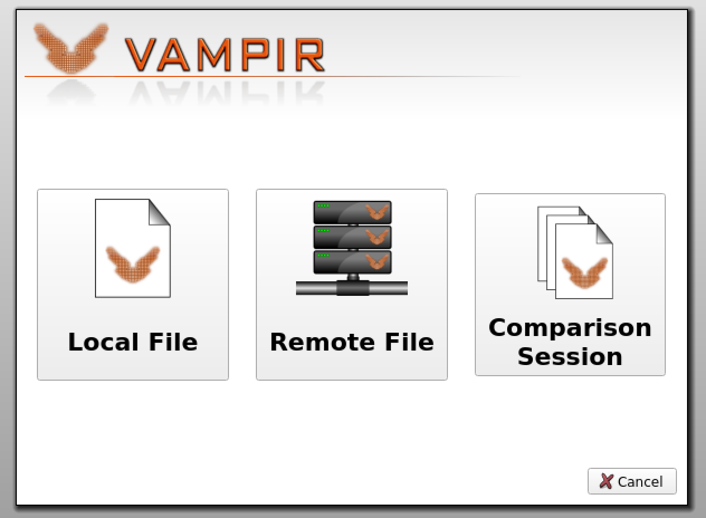
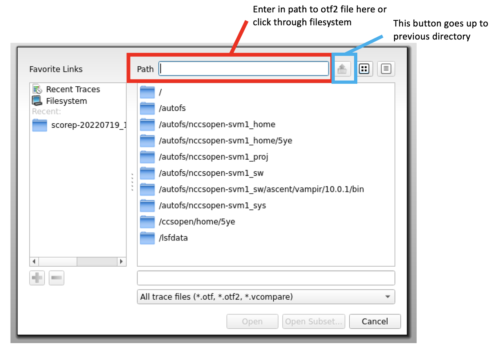
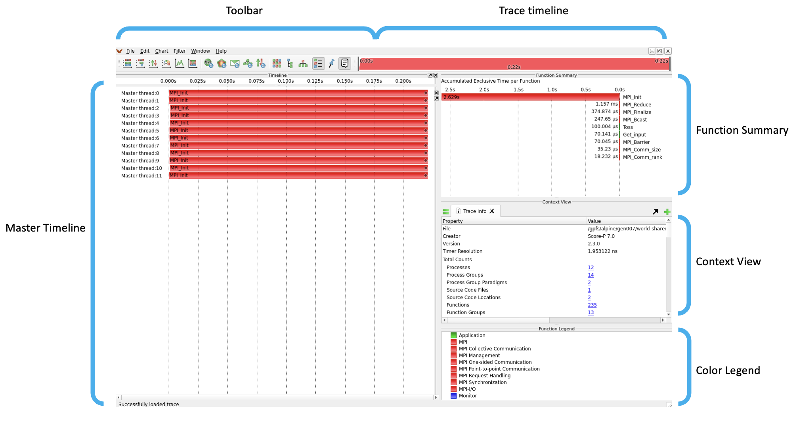
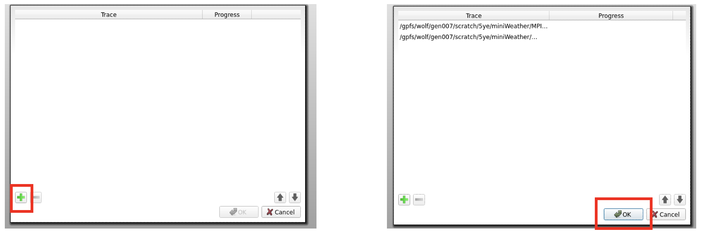

# Score-P and Vampir Basics

## What is Score-P and Vampir?

[Score-P](https://www.vi-hps.org/projects/score-p) is a profiling tool used to collect data on high-performance computing (HPC) applications. This data can include things like time and memory each function takes as well as how parallel processes are communicating with each other. The data collected from Score-P can then be analyzed with Vampir, which generates an interactive visualization that shows what functions in the code are actually doing. These two tools help to identify problematic areas of a program in order to make it more efficient. 

## Steps

There are 5 main steps when using Score-P:

1. Instrumenting
2. Profiling Run
3. Filtering
4. Tracing Run
5. Analyzing with Vampir

In this tutorial, we will walk through each one of these steps in detail with two example programs. 

## Step 1: Instrumenting

First off, to instrument Score-P you must add the `scorep` command as a prefix to the compiler. This can be done directly in the command line:

```
$ scorep gcc -c test.c
$ scorep gcc -o test test.o 
```

It can also be done in a Makefile. The `scorep` command can either be inserted right before the compiler variable or in its own variable as shown below:

```
## Makefile Example

CCOMP = gcc
CFLAGS = 
PREP = scorep

run: test.o
	$(PREP) $(CCOMP) $(CFLAGS) test.o -o test
test.o: test.c
	$(PREP) $(CCOMP) $(CFLAGS) -c test.c
clean:
	rm -rf test *.o
```

If using CMake files, however, it becomes a little more tricky. You would have to use the wrapper method to instrument Score-P:

```
## CMake Example

$ SCOREP_WRAPPER=off cmake .. \
	-DCMAKE_C_COMPILER=scorep-gcc \
	-DCMAKE_CXX_COMPIER=scorep-g++ \
	-DCMAKE_FORTRAN_COMPILER=scorep-ftn
```

We will go over this more in the miniWeather example program later on. 

### Practice with Monte Carlo Example

Let's try instrumenting Score-P in a Makefile! The Monte Carlo program was created as a demonstration of how MPI can be used to find the value of pi with the Monte Carlo method. For more information, see the [Monte Carlo Estimate PI](http://www.selkie.macalester.edu/csinparallel/modules/MPIProgramming/build/html/calculatePi/Pi.html) page. 

First of all, you will need to work with the Wolf filesystem instead of your host directory. To do this, you can go to your scratch directory:

```
$ cd /gpfs/wolf/<project>/scratch/<username>
```

Then you will need to copy over this Score-P challenge from your host directory:

```
$ cp -r /ccsopen/home/<username>/hands-on-with-summit/challenges/Score-P_and_Vampir_Basics .
```

>NOTE: the dot at the end of the above command means your current directory.

You should see the Score-P directory now when issuing the `ls` command. Now you are ready to work with Score-P on Ascent.

Before instrumenting Score-P, make sure you are in the `monte_carlo` directory:

```
$ cd /gpfs/wolf/<project>/scratch/<username>/Score-P_and_Vampir_Basics/monte_carlo
```

You will need to load the following modules:

```
$ module unload darshan-runtime
$ module load scorep gcc otf2 cubew
```

> NOTE: Loading the `scorep` module requires you to unload the `darshan-runtime` module first

Now, open the Makefile file with a text editor like vim:

```
$ vi Makefile
```

Add the `scorep` command in front of the `mpicc` compiler:

```
CCOMP = scorep mpicc
```

Then exit out of the Makefile, and you can compile with the `make` command:

```
$ make
scorep mpicc  -c calcPiMPI.c
scorep mpicc  calcPiMPI.o -o run
```

You have officially instrumented Score-P on this program and are ready to do a profiling run!

## Step 2: Profiling Run

In order to perform a profiling run, you will need to set some Score-P environment variables. By default, SCOREP_ENABLE_PROFILING is set to true and SCOREP_ENABLE_TRACING is set to false, but it's good to get in the habit of setting both of these variables before every profiing and tracing run. It's also a good idea to set `SCOREP_FILTERING_FILE` equal to `""`. Although you might not need to do this on the first profiling run, it's good to do it anyways. We will talk more about this variable later on. To see more Score-P variables and their default values, you can always use the `scorep-info config-vars --full` command.

These variables are set using the `export` command as seen below:

```
$ export SCOREP_ENABLE_PROFILING=true
```
Running a program with profiling enabled will produce a new directory that contains the profiling data. We will see what we can do with this as we profile the Monte Carlo program.

### Practice with Monte Carlo Example

First set the appropriate environment varibles:

```
$ export SCOREP_ENABLE_PROFILING=true
$ export SCOREP_ENABLE_TRACING=false
$ export SCOREP_FILTERING_FILE=""
```

Then you can submit the `submit.lsf` file with the `bsub` command to run the program.

```
$ bsub submit.lsf
```

To check the status of your job, use the `jobstat -u <username>` command. Once the job is complete, you should have a `monte_carlo.<job id>` file with the output of the program. You should also have a directory formatted `scorep-<yyyymmdd>-<time>-<unique id>`. This directory is named with the date and time it was created as well as a unique ID. Go to this directory using the `cd` command and list the contents with `ls`. You should see three files as shown below:

```
$ cd <scorep directory>
$ ls
MANIFEST.md  profile.cubex  scorep.cfg
```

To see profile data that Score-P collected, issue this command:

```
$ scorep-score -r profile.cubex
```

You should then see something like this:

```
Estimated aggregate size of event trace:                   6kB
Estimated requirements for largest trace buffer (max_buf): 474 bytes
Estimated memory requirements (SCOREP_TOTAL_MEMORY):       4097kB
(hint: When tracing set SCOREP_TOTAL_MEMORY=4097kB to avoid intermediate flushes
 or reduce requirements using USR regions filters.)

flt     type max_buf[B] visits time[s] time[%] time/visit[us]  region
         ALL        473    144    8.99   100.0       62454.34  ALL
         MPI        360     96    8.99   100.0       93669.22  MPI
         COM         48     24    0.00     0.0          30.32  COM
      SCOREP         41     12    0.00     0.0          28.31  SCOREP
         USR         24     12    0.00     0.0           9.29  USR

         MPI        132     24    0.00     0.0          45.55  MPI_Reduce
         MPI         66     12    0.00     0.0          13.13  MPI_Barrier
         MPI         66     12    0.00     0.0          34.60  MPI_Bcast
      SCOREP         41     12    0.00     0.0          28.31  run
         MPI         24     12    0.00     0.0           1.86  MPI_Comm_rank
         MPI         24     12    0.00     0.0           7.59  MPI_Comm_size
         MPI         24     12    0.00     0.0          30.82  MPI_Finalize
         MPI         24     12    8.99   100.0      749174.70  MPI_Init
         COM         24     12    0.00     0.0          54.86  main
         COM         24     12    0.00     0.0           5.77  Get_input
         USR         24     12    0.00     0.0           9.29  Toss
```

The first line is the estimated size of the trace file, in this case 6 kilobytes. The second line estimates the memory space needed on one process for a trace (474 bytes) and the third line estimates the total memory per process required by Score-P (4,097 kilobytes). In the table, you can see all the regions and region types along with information like the amount of space and time those regions take as well as the number of visits to those regions in the program. 

With this example, we can see that MPI functions that up most of the time, specifically the ` MPI_Init` function. 

## Step 3: Filtering

Before performing a tracing run, we need to use the data from the profiling run to filter out the regions. This makes sure the size of the trace file isn't too large. MPI and OpenMP regions can't be filtered out, so it is recommeded to filter out USR regions that are short, frequently called, and overall not super important to measure. 

To filter the profile results, we first create a filter file in which you can specify what regions to exclude and/or include. `SCOREP_REGION_NAMES_BEGIN` and `SCOREP_REGION_NAMES_END` are used to define the filter block.

```
# Filter File Example
SCOREP_REGION_NAMES_BEGIN
	EXCUDE *
	INCLUDE region_one
		region_two
		region_three
SCOREP_REGION_NAMES_END
```

In the above example, the `*` wildcard is used to signify all the regions. Basically, we're telling Score-P to filter out all regions except for the three regions specified after `INCLUDE`. To see the effects of the filter, you run `scorep-score` again, but this time include the `-f <filter file name>` flag:

```
$ scorep-score -f test.filter  profile.cubex
```

Below is an example of the outcome of this command with a different program:

```
Estimated aggregate size of event trace:                   474MB
Estimated requirements for largest trace buffer (max_buf): 79MB
Estimated memory requirements (SCOREP_TOTAL_MEMORY):       93MB
(hint: When tracing set SCOREP_TOTAL_MEMORY=93MB to avoid intermediate flushes
 or reduce requirements using USR regions filters.)

flt     type max_buf[B]     visits time[s] time[%] time/visit[us]  region
 -       ALL 86,123,768 11,336,078   98.15   100.0           8.66  ALL
 -       OMP 78,915,165 10,219,230   88.52    90.2           8.66  OMP
 -       MPI  3,861,412    341,966    6.39     6.5          18.68  MPI
 -       USR  1,905,020    432,246    0.20     0.2           0.47  USR
 -       COM  1,484,730    342,630    3.04     3.1           8.87  COM
 -    SCOREP         41          6    0.00     0.0          50.49  SCOREP

 *       ALL 82,776,618 10,561,202   94.91    96.7           8.99  ALL-FLT
 -       OMP 78,915,165 10,219,230   88.52    90.2           8.66  OMP-FLT
 -       MPI  3,861,412    341,966    6.39     6.5          18.68  MPI-FLT
 +       FLT  3,389,750    774,876    3.24     3.3           4.19  FLT
 -    SCOREP         41          6    0.00     0.0          50.49  SCOREP-FLT
```

Under the `flt` column, the `-` symbol means "not filterd", the `+` symbol means "filtered", and the `*` symbol means "possibly affected by the filter". In the above example, it shows that a little less than 3.4 Megabytes were filtered out and will be ignored during the trace.

Before submitting a job for a trace run, make sure you set the `SCOREP_FILTERING_FILE` enviroment variable to the path to the filter file you created. For example:

```
$ export SCOREP_FILTERING_FILE=~/scorep-20220612-1045-1234567890123456/test.filter
```

### Practice with Monte Carlo Example

Now let's apply this to the Monte Carlo Example! First create a new file inside the Score-P directory with a text editor like vim called `main.filter`:

```
$ vi main.filter
```

Since this is a small program, we will only filter out the `main` function so that we can see the other USR functions displayed in Vampir. However, in bigger programs, we would want to filter out more USR functions. To filter out `main`, add the following lines to the `main.filter` file.

```
SCOREP_REGION_NAMES_BEGIN
	EXCLUDE main
SCOREP_REGION_NAMES_END
```
Then issue the command:

```
$ scorep-score -r -f main.filter profile.cubex
```
And you should see somthing like this:

```
Estimated aggregate size of event trace:                   6kB
Estimated requirements for largest trace buffer (max_buf): 450 bytes
Estimated memory requirements (SCOREP_TOTAL_MEMORY):       4097kB
(hint: When tracing set SCOREP_TOTAL_MEMORY=4097kB to avoid intermediate flushes
 or reduce requirements using USR regions filters.)

flt     type max_buf[B] visits time[s] time[%] time/visit[us]  region
 -       ALL        473    144    8.99   100.0       62454.34  ALL
 -       MPI        360     96    8.99   100.0       93669.22  MPI
 -       COM         48     24    0.00     0.0          30.32  COM
 -    SCOREP         41     12    0.00     0.0          28.31  SCOREP
 -       USR         24     12    0.00     0.0           9.29  USR

 *       ALL        449    132    8.99   100.0       68127.01  ALL-FLT
 -       MPI        360     96    8.99   100.0       93669.22  MPI-FLT
 -    SCOREP         41     12    0.00     0.0          28.31  SCOREP-FLT
 +       FLT         24     12    0.00     0.0          54.86  FLT
 *       USR         24     12    0.00     0.0           9.29  USR-FLT
 *       COM         24     12    0.00     0.0           5.77  COM-FLT

 -       MPI        132     24    0.00     0.0          45.55  MPI_Reduce
 -       MPI         66     12    0.00     0.0          13.13  MPI_Barrier
 -       MPI         66     12    0.00     0.0          34.60  MPI_Bcast
 -    SCOREP         41     12    0.00     0.0          28.31  run
 -       MPI         24     12    0.00     0.0           1.86  MPI_Comm_rank
 -       MPI         24     12    0.00     0.0           7.59  MPI_Comm_size
 -       MPI         24     12    0.00     0.0          30.82  MPI_Finalize
 -       MPI         24     12    8.99   100.0      749174.70  MPI_Init
 +       COM         24     12    0.00     0.0          54.86  main
 -       COM         24     12    0.00     0.0           5.77  Get_input
 -       USR         24     12    0.00     0.0           9.29  Toss
```

You can see that only `main` will be filtered out while the rest of the functions will be traced and viewed in Vampir.

Next, assign the path to the `main.filter` file to the `SCOREP_FILTERING_FILE` variable:

```
$ export SCOREP_FILTERING_FILE=/gpfs/wolf/<project>/scratch/<username>/Score-P_and_Vampir_Basics/monte_carlo/<scorep directory>/main.filter
```

## Step 4: Tracing Run

After filtering out unwanted data, we can finally perform a tracing run. A trace will give us a more detailed look at what is happening inside the program. A tracing run is very similar to a profiling run but needs different Score-P environemt variable values.

### Practice with Monte Carlo Example

First, in addition to the `SCOREP_FILTERING_FILE` variable we set in the last step, there are other Score-P environemnt variables to set before running a trace measurement:

```
$ export SCOREP_ENABLE_PROFILING=false
$ export SCOREP_ENABLE_TRACING=true
$ export SCOREP_TOTAL_MEMORY=4097kB
```

Like the profiling run, the variables `SCOREP_ENABLE_PROFILING` and `SCOREP_ENABLE_TRACING` must be set to specify what action will take place during the run. It's also good to set `SCOREP_TOTAL_MEMORY` to the recommended amount in order to reduce the amount of memory required and to avoid flushes.

Once we have these variables set, get out of the scorep directory and submit the job!

```
$ cd ..
$ bsub submit.lsf
```

When the job is complete, you should see another directory named `scorep-<yyyymmdd>-<time>-<unique id>`. It should contain a `traces.otf2` file that we can use to view the trace with Vampir in the next step.

```
$ cd <new scorep directory>
$ ls
MANIFEST.md  scorep.cfg  scorep.filter traces  traces.def  traces.otf2   
```

## Step 5: Analyzing with Vampir

Now for the cool part. The `otf2` trace file generated by Score-P can be loaded on Vampir. There are a lot of graphs and timelines that can be used to analyze a program, but one major one is the Master Timeline. This feature shows the order of the functions called in each process as well as all the messages relayed between them. There are also function summaries that can tell you how much times is spent in each function across all processes as well as process summaries that focus on one process' function call stack.  

We will take a closer look at these features when we launch Vampir. 

### Practice with Monte Carlo Example

Now it's your turn!

In order to load Vampir on Ascent, you must have X forwarding. This process differs between Mac and Windows users, so follow the appropriate directions for what you are working with.

**Mac Users**

To log in with X forwarding, logout of Ascent, and then ssh back in with the -X flag:

```
$ ssh -X <username>@login1.ascent.olcf.ornl.gov
```

Another thing you will need to have is the XQuartz app. You can find XQuartz for MacOS here: [XQuartz Download](https://www.xquartz.org/)

> For users on an ORNL laptop: this can be accessed by going to ORNL Self Service in your launchpad (can also use search bar at the top to search for it). In ORNL Self Service, scroll down until you find XQuartz and click the Install button. 

**Windows Users**

Please go to the following links to set up Xming and Putty:

[Installing/Configuring PuTTy and Xming](http://www.geo.mtu.edu/geoschem/docs/putty_install.html).

[PuTTy Setup with SSH and X11](http://ocean.stanford.edu/courses/ESS141/PuTTY/).

While following the second link's instructions, use `login1.ascent.olcf.ornl.gov` hostname instead of "ocean.stanford.edu" and use your own username instead of "gp235". 

**Launching Vampir**
Once you have the necessary software and are logged in with X forwarding, you can load the Vampir module to your environment:

```
$ module load vampir
```
You should see a message like this:

```
Run VampirServer via
  $ vampirserver start -- -P <projid> [-q <queue>] [-w <walltime>]
and follow the instructions provided by this script.
Run the Vampir GUI remotely via X-forwarding
  $ vampir &
```

We will be using the `vampir &` command to lauch Vampir remotely since our trace file isn't very large. For large trace files (over 1 GB), see the [VampirServer Documentation](https://docs.olcf.ornl.gov/software/profiling/Vampir.html#vampir-using-vampirserver).

To lauch Vampir:

```
$ vampir &
```

>NOTE: If you get this message:

```
$ [Warning] could not connect to display localhost:12.0
[Fatal] This application failed to start because no Qt platform plugin could be initialized. Reinstalling the application may fix this problem.

Available platform plugins are: xcb.
```

>You either need to logout and log back in or there is something wrong with the XQuartz/Xming application. You might need to restart your computer to get the application going. 

This should open a Vampir window that looks like this:
<br>
<center>

</center>
<br>

To open the `otf2` file we created, click on "Local File" on the left (if the window shows a Recent Files page, just click "Open Other"). Then enter in the path to the file, in this case it would be `/gpfs/wolf/<project>/scratch/<username>/Score-P_and_Vampir_Basics/<2nd scorep directory>/traces.otf2`. 
<br>
<center>

</center>
<br>

After the file loads, you should see a Vampir GUI like the one below:
<br>
<center>

</center>
<br>
  
>NOTE: The timing will be different on each run, so your data on time won't be the exact same as this example

The master timeline is the big, frame on the left. This shows how each process runs over time and which functions are called according to the color-coded function group (the key for the colors is shown in the bottom right). The black diamonds at the end of this timeline signify message bursts (the darker and bigger the diamond, the more message activity there is). The frame in the top-right corner is the function summary, which breaks down the accumulated time spent in each function summed up across all the processes. Then the middle frame on the right is the context view that gives details about the trace. At the very very top is the trace timeline, which gives an general timeline of the trace.  

Feel free to play around with all the displays available. Try zooming in on the black diamond area at the end of the trace to see what kind of messaging is going on between functions. To zoom in, drag your mouse horizontally on the master timeline (For example, from 0.486 seconds to 0.490 seconds). You can zoom in as far as you need to see the messaging activity. Clicking on anything in the master timeline will give you information on the feature in the context view frame. You might also want to use the the top-left bar to add new frames to the overall display. For example, this button 
<br>
<center>

</center>
will open the process summary, which will show the call stack of functions in one process (you can change which process by right-clicking and selecting "Set Process". Also, if you want to search for a specific function, you can type "Control+F".

>NOTE: Launching Vampir on Ascent might act slow since it's working on a login node, so it could take the GUI a few seconds to load after clicking things.

Now you have successsfully profiled a program with Score-P as well as opened and used Vampir! 

For more information on everything Vampir can do, see this [Vampir Visualizations Guide](https://vampir.eu/tutorial/manual/performance_data_visualization#sec-commmatrix) page. 

## MiniWeather Example Program

MiniWeather is a mini application used to simulate weather-like flows. For our purposes, we will be more focused on profiling the program instead of the output, but feel free to dive more into miniWeather's specifics at this [MiniWeather](https://github.com/mrnorman/miniWeather) Github page.

The MiniWeather app uses CMake to compile and build the code, which requires a different approach when instrumenting Score-P. This makes it a bit more complicated, but we will walk through it. Additonally, miniWeather is great for comparing a program using different programming paradigms. Therefore, we will be profiling and tracing both MPI and MPI+OpenMP versions and then comparing them in Vampir.

Before starting, make sure you are in the right directory:

```
$ cd /gpfs/wolf/<project>/scratch/<username>/Score-P_and_Vampir_Basics/miniWeather
``` 

Then go to the `cmake.sh` file to edit it with vim.

```
$ vi cmake.sh
```

In order to instrument Score-P in CMake system, you will need to use the wrapper method. To do this, you will need to change the `CMAKE_CXX_COMPILER` variable from `mpic++` to `scorep-mpicxx` and insert `SCOREP_WRAPPER=off` before the `cmake` command:

```
SCOREP_WRAPPER=off cmake -DCMAKE_CXX_COMPILER=scorep-mpicxx                                                     \
      -DCXXFLAGS="-O3 -std=c++11 -I${ASCENT_PARALLEL_NETCDF_ROOT}/include"   \
      -DLDFLAGS="-L${ASCENT_PARALLEL_NETCDF_ROOT}/lib -lpnetcdf"                        \
      -DOPENMP_FLAGS="-fopenmp"                                                       \
      -DNX=200                                                                        \
      -DNZ=100                                                                        \
      -DDATA_SPEC="DATA_SPEC_GRAVITY_WAVES"                                           \
      -DSIM_TIME=1000                                                                 \
      .
```

Also make sure you have the `scorep`, `otf2`, and `cubew` modules. You can either add these commands to the cmake.sh file under the other `module load` commands, or you can load them normally in the command line.

```
module purge
module load DefApps gcc/9.1.0 cuda parallel-netcdf cmake
module unload darshan-runtime
module load scorep otf2 cubew
```

Now that the `cmake.sh` file is ready to go, exit out of vim and issue the following command:

```
$ source cmake.sh
```

This will create a couple of other CMake files as well as a Makefile. You can then compile and build with the `make` command:

```
$ make
```

For this MiniWeather Example, there are two different versions of the program: one uses just MPI while the other uses MPI and OpenMP threading. The `make` command will build both versions and create executables for both. It will also create test executables, so there will be four executables in total.

Now you can go through the rest of the Score-P steps as usual. First, set your Score-P environemt variables:

```
$ export SCOREP_ENABLE_PROFILING=true
$ export SCOREP_ENAABLE_TRACING=false
$ export SCOREP_FILTERING_FILE=""
```

Setting the `SCOREP_FILTERING_FILE` to two quotation marks is a way of emptying out whatever path was in there after a tracing run. If this variable has a file value when profiling, an error will occur.

Then you can submit the job. We will start with the MPI version.

```
$ bsub submit_mpi.lsf
```

Use `jobstat -u <username>` to check your job's status. Once complete, you can go to the new Score-P directory and use the `scorep-score -r profile.cubex` command to look at the profilng results. 

```
$ cd <score-p directory>
$ scorep-score -r profile.cubex
```

Below is a snippet of the profiling results from the MPI version (note that the results on time will be different for each individual profiling run):

```
$ cd <scorep directory>
$ scorep-score  -r profile.cubex

Estimated aggregate size of event trace:                   73MB
Estimated requirements for largest trace buffer (max_buf): 7MB
Estimated memory requirements (SCOREP_TOTAL_MEMORY):       9MB
(hint: When tracing set SCOREP_TOTAL_MEMORY=9MB to avoid intermediate flushes
 or reduce requirements using USR regions filters.)

flt     type max_buf[B]    visits time[s] time[%] time/visit[us]  region
         ALL  6,426,717 1,858,670  100.49   100.0          54.07  ALL
         MPI  3,861,412   683,432   23.84    23.7          34.88  MPI
         USR  1,782,534   813,966   56.66    56.4          69.60  USR
         COM    782,730   361,260   20.00    19.9          55.36  COM
      SCOREP         41        12    0.00     0.0          44.57  SCOREP

         MPI  1,602,000   216,000    0.33     0.3           1.51  MPI_Irecv
         MPI  1,602,000   216,000    0.58     0.6           2.70  MPI_Isend
         USR    521,794   237,084    0.11     0.1           0.46  gravity_waves(double, double, double&, double&, double&, double&, double&, double&)
         USR    521,794   237,084    0.11     0.1           0.45  hydro_const_bvfreq(double, double, double&, double&)
         MPI    468,000   216,000    2.26     2.2          10.47  MPI_Waitall
         COM    468,000   216,000   19.05    19.0          88.21  semi_discrete_step(double*, double*, double*, double, int, double*, double*)
         COM    234,000   108,000    0.43     0.4           4.00  set_halo_values_x(double*)
         USR    234,000   108,000   28.49    28.4         263.81  compute_tendencies_x(double*, double*, double*, double)
         USR    234,000   108,000    0.07     0.1           0.68  set_halo_values_z(double*)
         USR    234,000   108,000   27.87    27.7         258.02  compute_tendencies_z(double*, double*, double*, double)
         COM     78,000    36,000    0.11     0.1           2.98  perform_timestep(double*, double*, double*, double*, double)
         MPI     40,000     4,800    0.81     0.8         168.21  MPI_File_write_at_all
         USR     36,504    15,748    0.01     0.0           0.49  ncwrap(int, int)
         MPI     34,136     6,024    2.00     2.0         331.42  MPI_Allreduce
         MPI     30,100       301    0.01     0.0          28.38  MPI_File_write_at
         MPI     20,904     9,648    0.01     0.0           0.68  MPI_Comm_rank 
	 ...	 
```

Now we can create a filter file with vim:

```
$ vi scorep.filter
```

Then add the following lines to filter out all USR and COM regions. Feel free to go back and include some of the other regions, but for now we will just look at MPI and OpenMP functions.

```
SCOREP_REGION_NAMES_BEGIN
	EXCLUDE *
SCOREP_REGION_NAMES_END
``` 

Then issue the command to see the changes the filtering will make:

```
$ scorep-score -f scorep.filter profile.cubex 

Estimated aggregate size of event trace:                   44MB
Estimated requirements for largest trace buffer (max_buf): 3771kB
Estimated memory requirements (SCOREP_TOTAL_MEMORY):       6MB
(hint: When tracing set SCOREP_TOTAL_MEMORY=6MB to avoid intermediate flushes
 or reduce requirements using USR regions filters.)

flt     type max_buf[B]    visits time[s] time[%] time/visit[us]  region
 -       ALL  6,426,717 1,858,670  100.49   100.0          54.07  ALL
 -       MPI  3,861,412   683,432   23.84    23.7          34.88  MPI
 -       USR  1,782,534   813,966   56.66    56.4          69.60  USR
 -       COM    782,730   361,260   20.00    19.9          55.36  COM
 -    SCOREP         41        12    0.00     0.0          44.57  SCOREP

 *       ALL  3,861,453   683,444   23.84    23.7          34.88  ALL-FLT
 -       MPI  3,861,412   683,432   23.84    23.7          34.88  MPI-FLT
 +       FLT  2,565,264 1,175,226   76.66    76.3          65.23  FLT
 -    SCOREP         41        12    0.00     0.0          44.57  SCOREP-FLT
```

We can see that we are filtering out around 2.6 Megabytes!

Now assign the filtering file to the `SCOREP_FILTERING_FILE` variable and set the other Score-P environment variables for a tracing measurement:

```
$ export SCOREP_FILTERING_FILE=/gpfs/wolf/<project>/scratch/<username>/Score-P_and_Vampir_Basics/miniWeather/<scorep directory>/scorep.filter
$ export SCOREP_TOTAL_MEMORY=6MB
$ export SCOREP_ENABLE_PROFILING=false
$ export SCOREP_ENABLE_TRACING=true
```

Then go back up to the `miniWeather` drectory and submit the job.

```
$ cd ..
$ bsub submit_mpi.lsf
```

Once the job is complete, you should have another Score-P directory with the date, time, and unique ID. Move both the Score-P directories to the `MPI-scorep` directory with the `mv` command. This will avoid confusion between the MPI results and the OpenMP results. Later, when profiling and tracing the OpenMP version, move the Score-P directories to the `OpenMP-scorep` directory.

```
$ mv <scorep directory #1> MPI-scorep
$ mv <scorep directory #2> MPI-scorep
```

Now that we have the profiling and tracing results with just MPI, we can do the same thing with OpenMP. You can follow the same exact steps above in order to profile and trace the OpenMP version, except you will need to submit the `submit_openmp.lsf` file when submitting a job, and the `SCOREP_TOTAL_MEMORY` variable for the tracing run should be set to 93MB instead of 6MB. You don't need to rebuild the cmake files or compile with `make` again since you already have the `openmp` executable. Just start with the step for setting the Score-P environment variables for a profiling run and continue until you have both Score-P directories for OpenMP.

With the two trace files we just made (MPI and MPI_OpenMP), we can now use Vampir to compare them side by side. First, you will need to sign out of Ascent and sign back in with X forwarding:

```
$ ssh -X <username>@login1.ascent.olcf.ornl.gov
```

Enter in your password, then load and launch Vampir:

```
$ module load vampir
Run VampirServer via
  $ vampirserver start -- -P <projid> [-q <queue>] [-w <walltime>]
and follow the instructions provided by this script.
Run the Vampir GUI remotely via X-forwarding
  $ vampir &
$ vampir &
```

If Vampir opens up to a Recent Files page, click "Open Other". Then click the "Comparison Session" option, and then the green plus sign (shown below) to add files. Now select the "Local File" option and enter in the path to the MPI trace file or click through the file system to where the `trace.otf2` file is located. The path for the MPI trace file will be: `/gpfs/wolf/<roject>/scratch/<username>/Score-P_and_Vampir_Basics/miniWeather/MPI-scorep/<2nd scorep directory>/traces.otf2`. Then you can do the same thing with the OpenMP trace file (the path will be the same except that it will be in the `OpenMP-scorep` directory instead of `MPI-scorep`). If you need help figuring out the path to your trace file, use the `pwd` command in Ascent. 
<br>
<center>

</center>
<br>


After both files are selected and loaded, click "OK". Once it is loaded, you should see something like this:
<br>
<center>

</center>
<br>

The two background colors (white and purple) differentiate the two traces. In the image above, the white represents the trace that ran with just MPI, while the purple represents the trace that ran with MPI and OpenMP. In this case, the OpenMP trace ran faster than the MPI trace. 

You can now see many yellow traingles throughout the timeline, which signify I/O (input/output) events. You can zoom in on these events as well as the message bursts (represented by the black diamonds). Now that we can look at two traces side by side, try comparing several of the features and data. Does one trace spend more of its time in MPI functions than the other? Does the MPI_Init function take longer in one of the traces? Play around with Vampir and see what you can find!

## Challenges

Now that we have walked through how to incorporate Score-P in the Monte Carlo and MiniWeather programs, try one on your own! There are two challenges, called Jacobi and MiniSweep, that are available below.

**Jacobi**

The Jacobi program uses the Jacobi algorithm to solve the Poisson Equation. For more information on this algorithm, you can visit [this](https://people.sc.fsu.edu/~jburkardt/presentations/jacobi_poisson_1d.pdf) page.

This program has both MPI and OpenMP versions, so try using Vampir to compare them side by side. You will need the following modules:

```
$ module unload darshan-runtime
$ module load gcc scorep otf2 cubew
```

The solution to instrumenting Score-P in the Makefile for both MPI and OpenMP versions is in the `solutions/jacobi` directory. 

**MiniSweep**

MiniSweep is a mini application that focuses on radiative transport. Like MiniWeather, it also uses a CMake system. For more detailed information on what MiniSweep does, see the [MiniSweep](https://github.com/wdj/minisweep) page and look through the References section. You can also read through [this](https://github.com/wdj/minisweep/blob/master/doc/how_to_run.txt) explanation that describes the command line arguments, which you can change in the `submit.lsf` file and compare the results.

You will have to load the following modules:

```
$ module unload darshan-runtime
$ module load cmake gcc scorep otf2 cubew
```

On your own, go through all the steps detailed earlier to use Score-P and Vampir on MiniSweep. The solution to implementing Score-P on MiniSweep in the CMake file can be found in `solutions/miniSweep`. 

>NOTES: You may come across a warning when compiling, but this is not critical, and you can continue to submit the job as usual. Also, when it comes to filtering MiniSweep, you should filter out most, if not all, functions since there are so many USR functions that take up a lot of space.

## Score-P with GPU Programming

Score-P can also profile programs that utilize GPU programming, specifically with CUDA and OpenACC. Below are details on how to profile both CUDA and OpenACC programs with Score-P.

### CUDA

To use Score-P with CUDA code, there are just a few additional steps that need to be taken. To follow along, go to the `gpu-program-examples/redundant_MM` directory, which contains code that uses CUDA programming to multiply matrices:

```
$ cd /gpfs/wolf/<project>/scratch/<username>/Score-P_and_Vampir_Basics/gpu-program-examples/redundant_MM
```

You will also need the following modules:

```
$ module unload darshan-runtime
$ module load scorep/7.0-papi otf2 cubew gcc cuda essl
```

>NOTE: To use Score-P with CUDA, you need the `scorep/7.0-papi` version. The other versions do not support CUDA instrumentation.

One addition needed is, when instrumenting Score-P, you will need to include the `--cuda` flag after the `scorep` command, as seen in the redundant_MM Makefile:

```
CUCOMP  = scorep --cuda nvcc
```

Furthermore, when setting the Score-P environment variables, you will need to set `SCOREP_CUDA_ENABLE` equal to `yes`:

```
$ export SCOREP_CUDA_ENABLE=yes
```

After that, everything else is the same (filtering, tracing, etc.). You can now launch Vampir and see the CUDA kernels in addition to the master thread. If you need help with instrumenting the redundant_MM code, the Makefile solution can be found in `solutions/redundant_MM`. 

For more information on Score-P with CUDA, you can visit these sites: [VI_HPS slides](https://www.vi-hps.org/cms/upload/material/tw15/CUDA_Hands_On.pdf) and [CUDA Perfomance Measurement](https://scorepci.pages.jsc.fz-juelich.de/scorep-pipelines/docs/scorep-4.1/html/measurement.html#cuda_adapter). 

### OpenACC

The steps for using Score-P with OpenACC are very similar to the ones with CUDA. You can follow along with the OpenACC version of MiniWeather found in the `gpu-program-examples/miniWeather-openacc` directory:

```
$ cd /gpfs/wolf/<project>/scratch/<username>/Score-P_and_Vampir_Basics/gpu-program-examples/miniWeather-openacc
```

Make sure to load the `scorep`, `otf2`, and `cubew` modules either in the `cmake.sh` file or in the command line. The rest of the modules needed are already in `cmake.sh`. 

```
module purge
module load DefApps nvhpc/21.11 cuda parallel-netcdf cmake
module load scorep otf2 cubew
``` 

>NOTE Score-P with OpenACC instrumentation does not work with the gcc compiler, so we will be using nvhpc

After you build the CMake files with `source cmake.sh`, you will need to include the `--openacc` option when issuing the `make` command by setting the `SCOREP_WRAPPER_INSTRUMENTER_FLAGS` variable:

```
$ make SCOREP_WRAPPER_INSTRUMENTER_FLAGS=--openacc
```

You will also need to set the `SCOREP_OPENACC_ENABLE` variable to `yes` before profiling:

```
$ export SCOREP_OPENACC_ENABLE=yes
```

Then everything else in the Score-P process is the same, and you will be able to see the OpenACC functions in Vampir. The solution to instrumenting the `cmake.sh` file can be found in `solutions/miniWeather-openacc`. For more information, visit the [OpenACC Performance Measurement](https://scorepci.pages.jsc.fz-juelich.de/scorep-pipelines/docs/scorep-4.1/html/measurement.html#openacc_adapter) site. 

## Further Resources

[Score-P](https://scorepci.pages.jsc.fz-juelich.de/scorep-pipelines/docs/scorep-6.0/html/index.html)

[Vampir Visualizations Guide](https://vampir.eu/tutorial/manual/performance_data_visualization)

[Score-P OLCF Documentation](https://docs.olcf.ornl.gov/software/profiling/Scorep.html)

[Vampir OLCF Documentation](https://docs.olcf.ornl.gov/software/profiling/Vampir.html)

[OLCF Training Archives.](https://docs.olcf.ornl.gov/training/training_archive.html) (There are two Score-P presentations called "Intro to Score-P" and "Advanced Score-P" that are listed.) 

[Monte Carlo Code Explanation](http://www.selkie.macalester.edu/csinparallel/modules/MPIProgramming/build/html/calculatePi/Pi.html)

[MiniWeather Full Code and Explanation](https://github.com/mrnorman/miniWeather#running-the-code)

[MiniSweep Full Code and Explanation](https://github.com/wdj/minisweep)

[VI_HPS slides](https://www.vi-hps.org/cms/upload/material/tw15/CUDA_Hands_On.pdf)

[CUDA Perfomance Measurement](https://scorepci.pages.jsc.fz-juelich.de/scorep-pipelines/docs/scorep-4.1/html/measurement.html#cuda_adapter)

[Redudant_MM Code](https://github.com/olcf/HIP_for_CUDA_programmers/tree/master/examples/redundant_MM)
