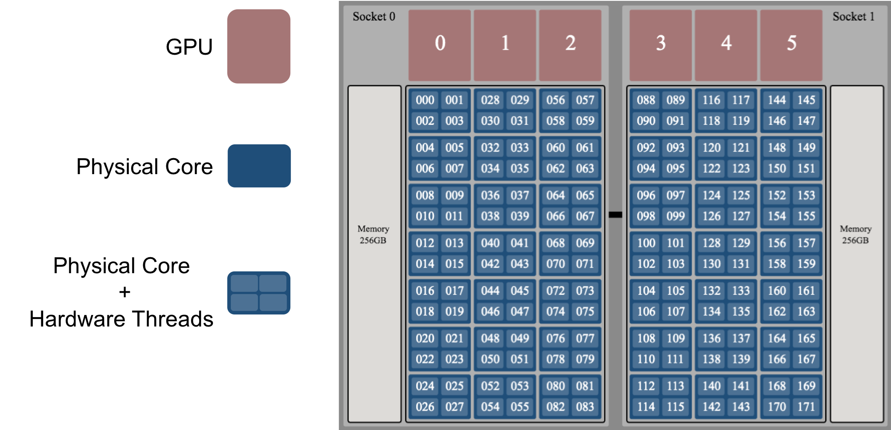
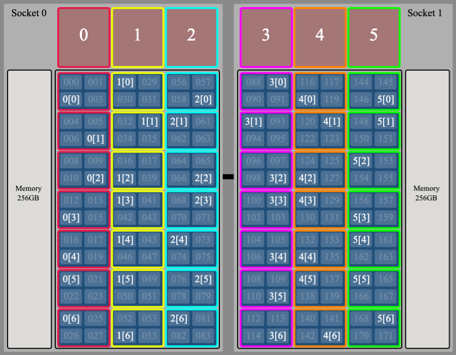

# `jsrun` Job Launcher

When running programs on a workstation, most of the time you can simply execute `./a.out` and wait for the results. On most HPC clusters, you must use a "batch scheduler" to request one or more compute nodes to run on and a "job launcher" to execute your program on the compute node(s) you were allocated. In this challenge, you will learn the basics of how to launch jobs on Summit with IBM's `jsrun` job launcher.

## Summit Nodes

Before getting started, it's instructive to look at a diagram of a Summit node to understand the terminology we'll use. 

Each Summit node contains 2 IBM Power9 CPUs and 6 NVIDIA V100 GPUs (1 CPU and 3 GPUs per socket). Each of the Power9 CPUs have 21 physical cores - each with 4 hardware threads. So, looking at the image below, physical core 0 contains hardware threads 000-003, physical core 1 contains hardware threads 004-007, etc. The numbering of hardware threads will be important as we proceed.

<br>
<center>

</center>
<br>

## Resource Sets

Resource sets are a central theme when discussing `jsrun`, so we should begin by defining them. 

* A <u>resource set</u> is a collection of resources (e.g., CPU cores, GPUs) that can be assigned to one or more tasks. 
* All resource sets are the same for a single `jsrun` command
* A resource set cannot span more than 1 node.

So a resource set might simply be a whole node (i.e., 42 physical CPU cores and 6 GPUs) or a subset of a node (e.g., 1 physical CPU core and 1 GPU). We'll use color-coded images like the one below to describe resource sets throughout this document, where each different colored set of CPUs and GPUs is a different resource set. In the diagram, in the M[T] numbering scheme, M represents the MPI rank ID and T represents the OpenMP thread ID. So for example, 2[1] represents MPI rank 2, OpenMP thread 1. This will become clearer as we continue below.

<br>
<center>

</center>
<br>

## `jsrun` Format

A `jsrun` command must contain the number of resource sets, a definition of the resource sets, and the program to be launched (along with its arguments). The basic format is as follows:

```c
jsrun [ # of resource sets ] [ definition of resource sets ] program [ program args ]
```

### Constructing a `jsrun` Command

The first step to contructing a `jsrun` command is to define the resource sets you want to use. The next step is to decide how many resource sets you want to use. This can be accomplished with the following set of flags:

<br>

| flag (long)      | flag (short) | description                               |
|----------------- | ------------ | ------------------------------------------|
| `--nrs`          | `-n`         | Number of resource sets                   |
| `--cpu_per_rs`   | `-c`         | Number of physical cores per resource set |
| `--gpu_per_rs`   | `-g`         | Number of GPUs per resource set           |
| `--tasks_per_rs` | `-a`         | Number of tasks per resource set          |

<br>
There is another flag we'll cover as well, but for now, let's just move forward with these.

## Job Step Viewer

To demonstrate the use of `jsrun`, we will use a tool called [Job Step Viewer](https://jobstepviewer.olcf.ornl.gov/). Job Step Viewer provides a graphical view of the mapping of processes and threads to the CPUs and GPUs on Summit nodes. It allows users to preview and quickly iterate with multiple jsrun options to understand and optimize job launch. It is a convenient tool that allows you to visualize and verify you are configuring your `jsrun` options in the way you expect.

To use Job Step Viewer, you must first load the module for it:

```
$ module load job-step-viewer
```

Job Step Viewer is implemented as a wrapper around `jsrun`, so you can use it to launch an executable as usual (for example):

```
$ jsrun -n1 -c1 -g1 -a1 ./a.out
```

Or, you can use it without an executable (for example):

```
$ jsrun -n1 -c1 -g1 -a1
```

In both cases, you would receive a unique URL that can be viewed in an internet browser (Mac users can Cmd-click it to open). The node(s) you were allocated will be highlighted in green (or possibly red) similar to the following image:

<br>
<center>

</center>
<br>

Green nodes indicate the node is being used by the `jsrun` launch. Nodes highlighted in red are allocated to your job, but not being used by this invocation of `jsrun`. For example, if you _allocate_ two nodes with `bsub` but only _launch_ your job on one core or GPU with `jsrun`, one of the allocated nodes will be sitting idle and will show as red on the top-down view. Clicking on one of the nodes in your allocation will bring up a diagram of the node showing the mapping of resource sets, processes, and threads to the CPUs and GPUs. Here is an example:

<br>
<center>

</center>
<br>

## Examples
In the following examples we will use Job Step Viewer to learn more about `jsrun` and test our understanding.

### Example 1

As a first example, let's try to create the layout shown in the image below. Here, we are essentially splitting up the resources on our node among 6 resource sets, where each resource set is shown as a different color and contains 7 physical CPU cores and 1 GPU. Recall that in the M[T] numbering scheme, M represents the MPI rank ID and T represents the OpenMP thread ID. So, for example, 2[0] represents MPI rank 2 - OpenMP thread 0. Based on the image, this means that each resource set contains 1 MPI rank and 1 OpenMP thread. 

<br>
<center>

</center>
<br>

Now let's try to create the `jsrun` command that will give us this layout. The first thing we need to do is define our resource sets. As shown in the image, each resource set will contain 7 physical CPU cores (`-c7`), 1 GPU (`-g1`), 1 MPI rank (`-a1`), and 1 OpenMP thread. To set the number of OpenMP threads, we will use the `OMP_NUM_THREADS` environment variable. Now that we have defined our resource sets, we can use `-n6` to create 6 of them.

So you should edit the `submit.lsf` file to read

```c
export OMP_NUM_THREADS=1

jsrun -n6 -c7 -g1 -a1
```

> NOTE: In these examples, we're using the `jsrun` wrapper provided by Job Step Viewer, which is why no executable is given in the command.

After running this code with `bsub submit.lsf`, you should find the a unique URL in the output file `testing_jsrun.JOBID`. By following the link, you'll see a diagram representing Ascent's 18 compute nodes. Click the green node (or click the "Nodes Used" dropdown) to see the process placement from your job. The diagram should be very similar to the image above. 

> NOTE: The exact hardware thread that a process/thread lands on will vary between runs and is expected, but the physical core should be the same.

### Example 2

For the next example, let's run the same program but use 2 OpenMP threads to create the layout shown in the image below. Although this example is very similar to the first one, it will help point out a subtlety that might otherwise be overlooked.

<br>
<center>

</center>
<br>

To create this layout, we will first try to simply change the number of OpenMP threads to 2 and rerun the same command we used in Example 1. To do so, edit the `submit.lsf` file to read

```c
$ export OMP_NUM_THREADS=2
$ jsrun -n6 -c7 -g1 -a1
```

Then submit the job to run on a compute node with the following command:

```c
$ bsub submit.lsf
```

By following the link in the output file, we can see that each MPI rank now has 2 OpenMP threads as intended. However, both OpenMP threads are running on hardware threads of the same physical core instead of on separate physical cores as shown in our image above.

> NOTE: Hardware threads 0-3 are all on the same physical CPU core. Your (incorrect) results should show OpenMP threads 0 and 1 of MPI rank 0 ran on two of these hardware threads.

So why did this happen? Each resource set has 7 physical cores available to it, so how do we use them? This brings us to a new flag:

<br>

| flag (long) | flag (short) | description                                                          |
|------------ | ------------ | ---------------------------------------------------------------------|
| `--bind`    | `-b`         | Binding of tasks within a resource set. Can be none, rs, or packed:#.|  

<br>

`--bind` allows you to set the number of physical cores available to an MPI task (to do things like spawn OpenMP threads on). By default, it is set to `-bpacked:1`, which means each MPI rank only has 1 physical core available to it. So when we spawned our 2 OpenMP threads from each MPI rank, they only had 1 physical core to run on (although 4 hardware threads). In some cases, this is undesired behavior that can slow down application performance.

<br>

If we want to run each OpenMP thread on its own physical core, we would need to set the `#` in `-bpacked:#` to the number of OpenMP threads we desire. So for our example, we would want `-bpacked:2`. Let's try that. Edit the `submit.lsf` file to read

```c
$ export OMP_NUM_THREADS=2
$ jsrun -n6 -c7 -g1 -a1 -bpacked:2
```

After running the job (`bsub submit.lsf`), you should now see the expected output. Success!

### Example 3

For our next example, we will split the resources on our node among 2 resource sets, with 1 resource set per socket. The desired layout will look like the image below. Here, we can see that each resource set contains 21 physical cores (`-c21`), 3 GPUs (`-g3`), and 3 MPI ranks (`-a3`; each with 1 OpenMP thread).

<br>

<center>

</center>

<br>

To create this layout, you should use the following commands:

```c
$ export OMP_NUM_THREADS=1
$ jsrun -n2 -c21 -g3 -a3 -bpacked:1
```

Success! 

## Summary of Options Covered Here

While this is not intended to be a comprehensive tutorial on `jsrun`, hopefully it has given you a decent foundation to create your own layouts with the job launcher. The `jsrun` flags we covered in this guide are summarized in the following table:

<br>

| flag (long)             | flag (short) | description                                    |
|------------------------ | ------------ | -----------------------------------------------|
| `--cpu_per_rs`          | `-c`         | Number of physical cores per resource set      | 
| `--gpu_per_rs`          | `-g`         | Number of GPUs per resource set                | 
| `--tasks_per_rs`        | `-a`         | Number of tasks per resource set               |
| `--nrs`                 | `-n`         | Number of resource sets                        | 
| `--bind`                | `-b`         | Binding of tasks within a resource set. Can be none, rs, or packed:#.|  

<br>

These flags will give most users the ability to create the resource layouts they desire but, as mentioned above, this is only a sub-set of the functionality available with `jsrun`. If you like to know more, you can check out the man page: `man jsrun`.

## Examples to Try on Your Own

Now that you have the basics down, you can try to create the `jsrun` commands to produce output that matches the images below.

### Example 4

6 resource sets, each with 7 physical CPU cores and 1 GPU - 1 MPI rank per resource set that has 7 OpenMP threads (each thread running on its own physical CPU core)

<br>
<center>

</center>
<br>


### Example 5

2 resource sets, each with 21 physical CPU cores and 3 GPUs - 1 MPI rank per resource set that has 21 OpenMP threads (each thread running on its own physical CPU core)

<br>
<center>

</center>
<br>

### Example 6

6 resource sets, each with 7 physical CPU cores and 1 GPU - 2 MPI ranks per resource set that each have 3 OpenMP threads (each thread running on its own physical CPU core)

<br>
<center>

</center>
<br>

### Example 7

1 resource set that contains 42 physical CPU cores and 6 GPUs - 6 MPI ranks that each have 7 OpenMP threads (each thread running on its own physical CPU core)

<br>
<center>

</center>
<br>

